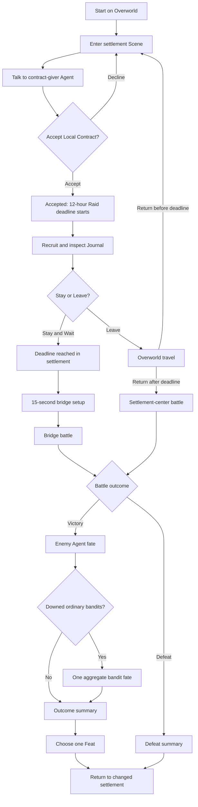

# Bold and Brave Playable Vertical Slice Specification

Status: decision-complete handoff contract

## 1. Purpose and destination

| Contract item | This section |
| --- | --- |
| Purpose | Define the complete product and technical contract for the Playable Vertical Slice. |
| Authoritative state and data | This file is the normative handoff. The decision map keeps the decision history. |
| Inputs and commands | The resolved decision map and its resolved ticket answers are the source inputs. There is no player command in this section. |
| Transitions | The work moves from decision mapping to iterative phase planning only after the completeness gate passes. |
| Outputs and player-visible feedback | The output is the normative handoff contract. The section does not add player-visible feedback. |
| Failure and edge behavior | An unresolved in-scope decision, an incomplete contract tuple, or an unverified acceptance claim blocks the handoff. |
| Fixed values or targets | The complete playable journey targets 45–60 minutes of play. |
| Evidence checkpoints | `CP-SPEC-END-TO-END`, `CP-SPEC-AUDIT` |

### Requirement classes

All requirement and state tables in this file are normative.

| Class | Meaning |
| --- | --- |
| `MUST` | A product, behavior, delivery, or support commitment. A failed check blocks acceptance. |
| `TARGET` | An authored tuning or performance goal. A miss requires more tuning before representative-quality acceptance. |
| `SHOULD` | Implementation guidance. A phase plan can depart from it only when the plan records the reason and keeps all `MUST` behavior. |

| ID | Class | Contract | Evidence |
| --- | --- | --- | --- |
| PVS-PUR-001 | MUST | Deliver one offline-style, single-player browser journey that starts with frontier preparation, resolves one timed defense Local Contract, and ends in the changed settlement with persistent human and material consequences. | `CP-SPEC-END-TO-END` |
| PVS-PUR-002 | MUST | Make directional melee, personal Band leadership, and a visible Agent relationship or Grievance consequence the representative-quality priorities. | `CP-SPEC-END-TO-END`, `CP-UI-FATE` |
| PVS-PUR-003 | TARGET | A competent first complete playthrough takes 45–60 minutes of real time. | `CP-SPEC-END-TO-END` |
| PVS-PUR-004 | SHOULD | Keep the Overworld, dialogue, settlement simulation, economy, and content volume deliberately simple when more detail does not improve a representative-quality priority. | `CP-SPEC-AUDIT` |

## 2. Scope, support envelope, and canonical terminology

| Contract item | This section |
| --- | --- |
| Purpose | Fix the playable boundary, promised machine, delivery mode, and shared language. |
| Authoritative state and data | The scope scenario, support row, rendering capability state, and terms in this section are authoritative. |
| Inputs and commands | The player uses normal keyboard, mouse-button, pointer-drag, and pointer-selection input. Startup reads browser and GPU capabilities. |
| Transitions | Startup moves from capability check to loading only when every support gate passes. The journey moves between the Overworld and one settlement Scene. |
| Outputs and player-visible feedback | Startup shows a readable unsupported, loading, or ready state. Gameplay uses only canonical terms in player-facing text where the term appears. |
| Failure and edge behavior | An unpromised browser or device can fail closed. WebGL fallback and a software adapter never enter gameplay. |
| Fixed values or targets | The promised row is Chromium 151.0.7922.137 on Linux x64 with an NVIDIA RTX 2070 SUPER and driver 610.57.04, at a 1920 × 1080 CSS-pixel viewport and device-pixel ratio no greater than 1.0. |
| Evidence checkpoints | `CP-SUPPORT-GATE`, `CP-SUPPORT-LOAD`, `CP-SPEC-AUDIT` |

### Scope contract

| ID | Class | Contract | Evidence |
| --- | --- | --- | --- |
| PVS-SCP-001 | MUST | Present a grounded low-fantasy, late-medieval frontier that feels dangerous, adventurous, and politically messy. Do not give the player magic in this slice. | `CP-UI-HUD`, `CP-SPEC-AUDIT` |
| PVS-SCP-002 | MUST | Provide one compact settlement, one free-roaming 3D Overworld, one fixed Companion, four recruitable Troop candidates, one enemy Agent, five ordinary bandits, and five generic settlement residents. | `CP-SPEC-END-TO-END`, `CP-PREP-RECRUIT` |
| PVS-SCP-003 | MUST | Allow a battle Band of the player character, the Companion, and zero to four recruited Troops. | `CP-PREP-RECRUIT`, `CP-COMMAND-GROUPS` |
| PVS-SCP-004 | MUST | Include one-handed sword, shield, and staff roles; a bridge defense; a late settlement-center defense; survivor-fate resolution; Agent consequences; and one player Feat choice after victory. | `CP-SPEC-END-TO-END` |
| PVS-SCP-005 | MUST | Run without an account, backend service, or server-owned gameplay state. Keep campaign saves in the browser. | `CP-SAVE-RESTORE`, `CP-SPEC-AUDIT` |
| PVS-SCP-006 | MUST | Use Three.js with WebGPU-only rendering. Detect and reject Three.js WebGL fallback before gameplay. | `CP-SUPPORT-GATE` |
| PVS-SCP-007 | MUST | Promise support only for Chromium 151.0.7922.137 on Linux x64 with an NVIDIA RTX 2070 SUPER and driver 610.57.04. The Linux distribution version is not part of the promise. | `CP-SUPPORT-GATE` |
| PVS-SCP-008 | MUST | Test the promised row at 1920 × 1080 CSS pixels with a maximum device-pixel ratio of 1.0. | `CP-SUPPORT-GATE`, `CP-PERFORMANCE` |
| PVS-SCP-009 | MUST | Require a secure context, a physical WebGPU adapter, a usable device, and core WebGPU capabilities only. Request the `high-performance` adapter preference as a hint. | `CP-SUPPORT-GATE` |
| PVS-SCP-010 | MUST | Support normal keyboard-and-mouse play. Do not make a keyboard-only, touch, mobile, reduced-motion, other-browser, other-GPU, or other-driver support promise. | `CP-SUPPORT-GATE`, `CP-SPEC-AUDIT` |

### Canonical terminology

| Term | Meaning in this contract |
| --- | --- |
| Playable Vertical Slice | The smallest self-contained version of Bold and Brave that delivers its defining player experience at representative quality and can anchor later development phases. |
| Band | The player-led group that contains the player character, any Companions, and ordinary Troops who travel and fight together. |
| Combatant | A person who takes part in a battle. The term does not replace that person's social identity or Agent fate. |
| Command group | The Companion or grouped Troops that receive one shared order. |
| Hold position | A designated place in a Scene where a Command group defends near a visible marker until it gets another order. |
| Companion | A socially developed Agent who joins the Band and can act with some independence. |
| Agent | A named, persistent non-player character who can have relationships, Grievances, and independent action. |
| Disposition | An Active Agent's current `Friendly`, `Neutral`, or `Hostile` stance toward the player character or Band. |
| Grievance | A persistent fixed-cause remembered wrong or debt that can explain an Agent's behavior. |
| Agent relationship | One Agent's Disposition and active Grievances. It is not a settlement or faction score. |
| Agent fate | A named Agent's persistent `Active`, `Captive`, or `Executed` condition. Only an Active Agent has a Disposition. |
| Downed | Alive but unable to fight. During battle, this condition has the same presentation as a dead Combatant. |
| Directional Guard | A sword or staff guard in one of four sectors. A matching sector fully negates an incoming attack and recoils the attacker. |
| Shield Block | An omnidirectional defense that blocks attacks while held and consumes stamina. |
| Captive | A Downed former enemy whom the Band retains through a Capture decision. |
| Troop | An individually persistent but socially lightweight Band member who is defined mainly by equipment, health, and proficiency. |
| Feat | A persistent player-character capability selected as a result of progression. |
| Overworld | The simple strategic 3D space through which the Band travels between notable locations. |
| Scene | A separately loaded 3D space for a settlement, battle, camp, or other notable location. |
| Settlement condition | The post-contract `Safe` or `Damaged` state of the settlement. |
| Raid location | The bridge for an on-time defense, or the settlement center for an entry after the Raid deadline. |
| Raid deadline | The time threshold that starts the raid while an Accepted Local Contract is active. |
| Settlement resident | An armed or unarmed person in the settlement Scene who does not have to be a named Agent. |
| Journal | The player-facing record of the Local Contract, Band, preparation, resources, deadline, saves, and persistent consequences. |
| Local Contract | A consequential undertaking offered at a location and resolved by the Band. |
| Local Contract state | The `Available`, `Accepted`, `Resolved`, or `Failed` stage of the Local Contract. |
| Renown | The public recognition that the player character and Band accumulate. Renown has no active system in this slice. |
| Coin | The Band's general-purpose money. |
| Provisions | Supplies that the Band consumes during Overworld travel. |

## 3. Campaign and Scene flow

| Contract item | This section |
| --- | --- |
| Purpose | Define the complete player journey, campaign states, Scene changes, battle entry, and outcome sequence. |
| Authoritative state and data | Campaign time, Scene, position, Local Contract state, Raid deadline, Raid location, battle outcome, and Settlement condition are authoritative Simulation state. |
| Inputs and commands | Click-to-move, camera rotate and zoom, `Space`, time-speed keys `1`–`4`, `Talk`, `Accept`, `Decline`, `Wait`, `Journal`, `Leave`, survivor-fate choices, and Feat choice. |
| Transitions | The flow diagram and state tables in this section define every legal campaign and battle transition. |
| Outputs and player-visible feedback | The Overworld clock, Local Contract panel, Journal, bridge setup marker, battle result, outcome summary, and changed settlement show the current state. |
| Failure and edge behavior | Illegal commands keep the current state and produce an invalid-action response. Defeat has priority when victory and defeat conditions become true on the same Simulation tick. |
| Fixed values or targets | The Band starts 0.5 Overworld day from the settlement. The route is 1.5 world units at 3 world units per Overworld day. The Raid deadline is 12 Overworld hours after acceptance. Bridge setup lasts 15 real-time seconds. |
| Evidence checkpoints | `CP-FLOW-CONTRACT`, `CP-FLOW-EARLY`, `CP-FLOW-LATE`, `CP-FLOW-DEFEAT` |

### End-to-end player journey

### Flow requirements

| ID | Class | Contract | Evidence |
| --- | --- | --- | --- |
| PVS-FLW-001 | MUST | Start a new campaign on the Overworld 1.5 world units, or 0.5 Overworld day at normal movement speed, outside the settlement entry boundary. | `CP-FLOW-CONTRACT` |
| PVS-FLW-002 | MUST | Use direct click-to-move on traversable Overworld ground. Allow camera rotation and zoom. Advance campaign time only while the Band moves. Stop time and Provisions consumption while the Band is stationary or paused. | `CP-FLOW-CONTRACT`, `CP-PREP-PROVISIONS` |
| PVS-FLW-003 | MUST | Make `Space` pause or unpause Overworld movement and time. Make keys `1`, `2`, `3`, and `4` select 1×, 2×, 3×, and 4× time speed. A speed key also unpauses a paused Overworld. | `CP-FLOW-CONTRACT` |
| PVS-FLW-004 | MUST | At 1× speed, advance one Overworld hour in 5 real-time seconds. Apply the selected multiplier to movement, campaign time, and Provisions consumption without changing the distance-based result. | `CP-FLOW-CONTRACT`, `CP-PREP-PROVISIONS` |
| PVS-FLW-005 | MUST | Load the one settlement Scene automatically when the Band crosses its entry boundary. Keep the bridge and settlement center as areas in this same Scene. | `CP-FLOW-CONTRACT`, `CP-FLOW-LATE` |
| PVS-FLW-006 | MUST | Provide `Talk`, `Wait`, `Journal`, and `Leave` as the settlement contextual actions. Use short text-only dialogue and no branching conversation tree. | `CP-FLOW-CONTRACT`, `CP-UI-HUD` |
| PVS-FLW-007 | MUST | Make `Talk` with the contract-giver Agent the only route to the Local Contract offer. Show the objective, bridge, enemy Agent, five bandits, one-Feat victory reward, zero-Coin reward, settlement risk, and current Local Contract state before `Accept` or `Decline`. | `CP-FLOW-CONTRACT` |
| PVS-FLW-008 | MUST | Make each `Wait` command advance campaign time by 1 Overworld hour while the Local Contract is Available or Accepted. Do not advance campaign time through ordinary settlement interaction, bridge setup, or battle. | `CP-FLOW-CONTRACT`, `CP-FLOW-EARLY` |
| PVS-FLW-009 | MUST | Make the Journal show Local Contract state, the Raid deadline after acceptance, Band members, equipment, Coin, Provisions, saves, and persistent consequences. Use the Journal as the preparation access point. | `CP-FLOW-CONTRACT`, `CP-PREP-RECRUIT` |
| PVS-FLW-010 | MUST | Make `Leave` return the Band to the Overworld at the settlement boundary without changing campaign time, Provisions, Local Contract state, or Band state. | `CP-FLOW-CONTRACT` |
| PVS-FLW-011 | MUST | Start bridge setup when the Raid deadline is reached while the Band is in the settlement. Allow 15 real-time seconds to move and place Companion and Troop Hold markers. Do not use a separate deployment screen. | `CP-FLOW-EARLY` |
| PVS-FLW-012 | MUST | Let Overworld travel continue when the Raid deadline passes outside the settlement. Start the settlement-center battle immediately, with no deployment window, when the Band enters after the deadline. | `CP-FLOW-LATE` |
| PVS-FLW-013 | MUST | Freeze active combat on the first tick that produces an outcome. Move directly to victory resolution or the defeat summary. Do not continue attacks, movement, damage, or Simulation time after the outcome. | `CP-FLOW-EARLY`, `CP-FLOW-DEFEAT` |
| PVS-FLW-014 | MUST | After victory, resolve the enemy Agent fate, resolve all Downed ordinary bandits with one aggregate choice when any exist, show the outcome summary, offer one Feat, and then return to the changed settlement. | `CP-FLOW-EARLY`, `CP-FEAT` |
| PVS-FLW-015 | MUST | After defeat, skip all survivor-fate choices and the Feat choice, show the current losses, and return to the changed settlement. | `CP-FLOW-DEFEAT` |
| PVS-FLW-016 | MUST | After a Resolved or Failed result, keep the Journal read-only for contract and preparation changes. Make `Talk` with Village Elder show the changed authored reaction. Do not provide a retry. | `CP-REL-FAILURE`, `CP-SPEC-END-TO-END` |
| PVS-FLW-020 | MUST | Make the river impassable except at the bridge. Give both banks small staging and formation areas with limited flanking room and no alternate crossing. Start the Band and five residents on the settlement side and the six raiders on the far bank. | `CP-FLOW-EARLY` |
| PVS-FLW-021 | MUST | Make every outcome summary show victory or defeat, Band and resident casualties, enemy survivor fates when resolved, Captive count, Settlement condition, and Local Contract state. | `CP-SPEC-END-TO-END`, `CP-FLOW-DEFEAT` |
| PVS-FLW-022 | SHOULD | Keep the Overworld free-roaming and keep its travel model able to add more locations without changing this slice's one-destination behavior. | `CP-SPEC-AUDIT` |

### Local Contract state table

PVS-FLW-017 (`MUST`): implement these transitions exactly. Evidence: `CP-FLOW-CONTRACT`, `CP-FLOW-EARLY`, `CP-FLOW-LATE`, `CP-FLOW-DEFEAT`.

| Current state | Trigger | Guard | Next state | Required result |
| --- | --- | --- | --- | --- |
| `Available` | Enter settlement | None | `Available` | Enter normal settlement play. Do not create a Raid deadline. |
| `Available` | `Leave` | Player is in the settlement | `Available` | Return to the Overworld with no Local Contract change. |
| `Available` | `Decline` | Offer panel is open | `Available` | Close the offer. Do not create a Raid deadline. |
| `Available` | `Wait` | Player is in the settlement | `Available` | Advance 1 Overworld hour. Do not create or advance a raid timer. |
| `Available` | `Accept` | Offer panel is open | `Accepted` | Set the Raid deadline to current campaign time plus 12 Overworld hours. |
| `Accepted` | `Wait` | Player is in the settlement and current time is before the deadline | `Accepted` | Advance up to 1 Overworld hour. Start bridge setup at the exact deadline. |
| `Accepted` | `Leave` | Player is in the settlement and no battle is active | `Accepted` | Return to the Overworld with the same Raid deadline. |
| `Accepted` | Raid deadline reached | Band is in the settlement | `Accepted` | Start bridge setup at the exact deadline. |
| `Accepted` | Raid deadline passes | Band is in the Overworld | `Accepted` | Continue Overworld travel without interruption. |
| `Accepted` | Enter settlement | Current time is before the deadline | `Accepted` | Enter normal settlement play. |
| `Accepted` | Enter settlement | Current time is at or after the deadline | `Accepted` | Start the settlement-center battle immediately. |
| `Accepted` | Battle victory | All raiders are Downed or killed and no defeat condition is true | `Resolved` | Start survivor-fate resolution. |
| `Accepted` | Battle defeat | All Band members are defeated or no settlement residents remain | `Failed` | Start the defeat summary. |
| `Resolved` | Any contract command | None | `Resolved` | Reject the command. Keep the contract record read-only. |
| `Failed` | Any contract command | None | `Failed` | Reject the command. Keep the contract record read-only. |

### Battle outcome state table

PVS-FLW-018 (`MUST`): evaluate outcome guards after all effects for one 60 Hz Simulation tick. Apply the first true row. Evidence: `CP-FLOW-EARLY`, `CP-FLOW-LATE`, `CP-FLOW-DEFEAT`.

| Priority | Current state | Guard after the tick | Next state | Required result |
| --- | --- | --- | --- | --- |
| 1 | `Active battle` | No settlement resident remains active | `Defeat` | Freeze battle; Local Contract becomes Failed. |
| 2 | `Active battle` | Every Band member is Downed or killed | `Defeat` | Freeze battle; Local Contract becomes Failed. |
| 3 | `Active battle` | Enemy Agent and all five bandits are Downed or killed | `Victory` | Freeze battle; Local Contract becomes Resolved. |
| 4 | `Active battle` | No prior guard is true | `Active battle` | Continue the next fixed tick. |
| — | `Victory` or `Defeat` | Any battle input | Same terminal outcome | Ignore gameplay input until the next resolution command is valid. |

### Settlement condition state table

Before an outcome, the Settlement condition field is not set; this is not a third Settlement condition. PVS-FLW-019 (`MUST`): apply the following outcome transition once and keep it for the rest of the slice. Evidence: `CP-FLOW-EARLY`, `CP-FLOW-LATE`, `CP-FLOW-DEFEAT`.

| Raid location | Battle outcome | Settlement condition | Visible consequence |
| --- | --- | --- | --- |
| Bridge | Victory | `Safe` | Show an intact changed settlement and successful reactions. |
| Settlement center | Victory | `Damaged` | Show damage while still applying successful-defense Agent and Feat rules. |
| Bridge or settlement center | Defeat | `Damaged` | Show damage, hostile settlement-Agent reactions, and the defeat record. |

## 4. Combat, Band commands, and Combatant behavior

| Contract item | This section |
| --- | --- |
| Purpose | Define directional combat, equipment roles, health and stamina, casualties, commands, formations, and battle behavior. |
| Authoritative state and data | Combatant health, stamina, action phase, sector, position, target, active status, Command group order, Hold marker, and seeded casualty draw are authoritative Simulation state. |
| Inputs and commands | `WASD`, primary-button drag and release, secondary-button drag or hold, guard-mode toggle, pause, Command group selection, `Follow`, `Hold`, `Engage`, and Hold-marker placement. |
| Transitions | Input moves an action through preview, wind-up, active, recovery, guard, exhaustion, Downed, or killed states. Orders move groups between Follow, Hold, and Engage behavior. |
| Outputs and player-visible feedback | Weapon pose, sector control, stamina, telegraphs, reactions, Hold markers, formation movement, audio events, and outcome state show combat results. |
| Failure and edge behavior | Invalid orders and guard modes keep the prior state. One attack can damage each valid enemy only once. Friendly fire is disabled. Downed and killed Combatants are invulnerable and non-targetable. |
| Fixed values or targets | Combat uses four sectors, 60 Hz state updates, the health, movement, damage, stamina, and timing values below, and at most two raiders in a committed attack at one time. |
| Evidence checkpoints | `CP-COMBAT-INPUT`, `CP-COMBAT-GUARD`, `CP-COMBAT-DAMAGE`, `CP-COMBAT-CASUALTY`, `CP-COMMAND-GROUPS`, `CP-COMMAND-AI` |

### Controls and action model

| ID | Class | Contract | Evidence |
| --- | --- | --- | --- |
| PVS-COM-001 | MUST | Use a stable over-the-shoulder combat camera and camera-relative `WASD` movement. Keep the active exchange and spacing readable. Do not use target lock. | `CP-COMBAT-INPUT`, `CP-UI-HUD` |
| PVS-COM-002 | MUST | On primary-button press, start an attack preview at the pointer origin. After a target dead zone of 24 CSS pixels, map the screen-relative drag to Up/Overhead, Left cut, Right cut, or Down/Thrust. Hold to preserve and revise the preview. Release to commit. | `CP-COMBAT-INPUT` |
| PVS-COM-003 | MUST | On secondary-button hold in Directional Guard mode, use the same four-sector drag vocabulary. Make a changed sector effective only after the 0.25-second guard transition. End the guard on release. | `CP-COMBAT-GUARD` |
| PVS-COM-004 | MUST | Give the player character a fixed sword-and-shield loadout. Use `Q` while idle to toggle between sword Directional Guard and Shield Block. Keep attack input on the sword in both modes. Give the Companion a fixed sword loadout and every Troop a fixed staff loadout. | `CP-COMBAT-GUARD`, `CP-PREP-RECRUIT` |
| PVS-COM-005 | MUST | Raise Shield Block in 0.20 seconds, block every sector while held, drain stamina continuously, and give no attacker recoil. End the block and apply a 0.40-second blocker stagger at zero stamina. | `CP-COMBAT-GUARD` |
| PVS-COM-006 | MUST | Let a matching Directional Guard negate all damage and apply a 0.30-second attacker recoil. Let a mismatched Directional Guard fail and apply full attack damage. | `CP-COMBAT-GUARD` |
| PVS-COM-007 | MUST | Charge attack stamina on release. Permit a committed attack to cancel into guard only during wind-up and do not refund its stamina. Once active, make it continue through recovery. | `CP-COMBAT-INPUT`, `CP-COMBAT-GUARD` |
| PVS-COM-008 | MUST | Keep movement available during combat actions. Apply 75% of base speed while previewing or guarding, 80% during wind-up, and 65% during active and recovery phases. | `CP-COMBAT-INPUT` |
| PVS-COM-009 | MUST | Make `Space` have no battle action. The slice has no dodge. `Escape` can pause or resume active combat, but save and load remain unavailable until a save-safe boundary. | `CP-COMBAT-INPUT`, `CP-SAVE-RESTORE` |

### Weapon values

PVS-COM-010 (`MUST`): use health points for damage and seconds for timing. A staff adds 0.10 seconds to the matching sword wind-up and uses the same recovery. Evidence: `CP-COMBAT-DAMAGE`.

| Weapon | Sector | Damage | Wind-up | Recovery | Relative role |
| --- | --- | ---: | ---: | ---: | --- |
| Sword | Overhead | 24 health points | 0.65 seconds | 0.55 seconds | Highest sword damage and longest hit reaction |
| Sword | Left cut | 20 health points | 0.55 seconds | 0.45 seconds | Balanced side path |
| Sword | Right cut | 20 health points | 0.55 seconds | 0.45 seconds | Balanced side path |
| Sword | Thrust | 16 health points | 0.45 seconds | 0.60 seconds | Longest sword reach |
| Staff | Overhead | 20 health points | 0.75 seconds | 0.55 seconds | Highest staff damage and longest hit reaction |
| Staff | Left cut | 16 health points | 0.65 seconds | 0.45 seconds | Balanced side path |
| Staff | Right cut | 16 health points | 0.65 seconds | 0.45 seconds | Balanced side path |
| Staff | Thrust | 13 health points | 0.55 seconds | 0.60 seconds | Longest staff reach |

| ID | Class | Contract | Evidence |
| --- | --- | --- | --- |
| PVS-COM-011 | MUST | Sweep the authored weapon path against every valid enemy. Apply full fixed damage with no target falloff. Apply damage to each target no more than once per committed attack. | `CP-COMBAT-DAMAGE` |
| PVS-COM-012 | MUST | Use one health value per Combatant. Do not use hit zones, armor calculations, or friendly fire. A missed or interrupted attack produces no damage. | `CP-COMBAT-DAMAGE` |
| PVS-COM-013 | MUST | Use 100 maximum stamina for every Combatant, 12 stamina per committed attack, a 1.2-second regeneration delay, and 25 stamina per second regeneration. Directional Guard costs 6 stamina per second; Shield Block costs 18 stamina per second. | `CP-COMBAT-GUARD` |
| PVS-COM-014 | MUST | At zero stamina, end any guard and disable attack and guard actions. Start regeneration after 1.2 seconds without spending stamina. Re-enable combat actions when stamina reaches 12. | `CP-COMBAT-GUARD` |

### Combatant values and casualty rules

PVS-COM-015 (`MUST`): use the following base values. Movement is measured in world units per real-time second. Health is measured in health points. Evidence: `CP-COMBAT-DAMAGE`, `CP-COMBAT-CASUALTY`, `CP-COMMAND-AI`.

| Combatant role | Maximum health | Base movement | Zero-health result |
| --- | ---: | ---: | --- |
| Player character | 100 health points | 3.5 world units/second | Downed |
| Companion | 100 health points | 3.4 world units/second | Downed |
| Troop | 70 health points | 3.0 world units/second | 20% Downed; 80% killed from the seeded draw |
| Enemy Agent | 110 health points | 2.8 world units/second | Downed |
| Ordinary bandit | 40 health points | 2.6 world units/second | 20% Downed; 80% killed from the seeded draw |
| Settlement resident | 100 health points | 2.0 world units/second | Killed |

| ID | Class | Contract | Evidence |
| --- | --- | --- | --- |
| PVS-COM-016 | MUST | Give the Companion a baseline Engage pressure of 5 health points per second and each Troop 8 health points per second. Make an enemy strike deal 12 health points, show its sector for 0.80 seconds, and use a 2.1-second baseline strike interval. | `CP-COMMAND-AI` |
| PVS-COM-017 | MUST | Resolve each Troop or ordinary-bandit zero-health event with one seeded random value. Values below 0.20 produce Downed; values at or above 0.20 produce killed. | `CP-COMBAT-CASUALTY` |
| PVS-COM-018 | MUST | Remove Downed and killed Combatants from active combat immediately. Keep them non-targetable, invulnerable, and visually indistinguishable until post-battle resolution. Do not revive them during battle. | `CP-COMBAT-CASUALTY`, `CP-UI-FATE` |
| PVS-COM-019 | MUST | After victory, restore a Downed player character or Companion to 25 health points. Keep a Downed Troop at 0 health points and unavailable. Remove a killed Troop from the Band. | `CP-COMBAT-CASUALTY` |
| PVS-COM-020 | MUST | Place five residents in each battle setup: two armed and three unarmed. Armed residents defend above 20 health points and flee at or below 20 health points. Unarmed residents flee from the start. Keep all five valid raid targets. | `CP-FLOW-LATE`, `CP-COMMAND-AI` |
| PVS-COM-021 | TARGET | A competent player who commands the Band and uses directional defense completes the bridge battle in 3–5 minutes and the settlement-center battle in 4–6 minutes of active real time. | `CP-PERFORMANCE`, `CP-SPEC-END-TO-END` |

### Band orders and behavior

PVS-CMD-001 (`MUST`): expose the Companion and recruited Troops as two independently selected Command groups. If no Troop is recruited or a group has no active member, reject its selection or order and keep the current state. Evidence: `CP-COMMAND-GROUPS`.

| Order | Group transition and behavior | Completion feedback |
| --- | --- | --- |
| `Follow` | Cancel the prior Hold marker or Engage target. Companion stays near the player's flank. Troops form a compact line behind or beside the player. Attack only nearby threats and do not chase away from the player. | Formation movement and one nonverbal response after issue |
| `Hold` | Enter marker placement, accept one traversable world position, then anchor the selected group around the visible marker. Defend locally and do not advance. | Marker, group movement, and an off-screen direction indicator |
| `Engage` | Cancel the Hold marker. Advance in role-appropriate formation toward the nearest active enemy that threatens the group. The player does not select one enemy. | Formation advance and target change in state projection |

| ID | Class | Contract | Evidence |
| --- | --- | --- | --- |
| PVS-CMD-002 | MUST | Reject a Hold point on impassable ground. Keep the previous order and marker, show the invalid marker state, and emit the invalid-order cue. | `CP-COMMAND-GROUPS` |
| PVS-CMD-003 | MUST | When an Engage target leaves active combat, select the nearest remaining active threat on the next fixed tick. Make a Follow group return to formation. Make a Hold group return to its marker unless a nearby enemy requires self-defense. | `CP-COMMAND-GROUPS` |
| PVS-CMD-004 | MUST | Make the enemy Agent coordinate pressure and primarily engage the player. Let the Agent briefly protect a threatened bandit cluster or reopen the raid escape route. Make each bandit select the nearest hostile Combatant within the raid objective. | `CP-COMMAND-AI` |
| PVS-CMD-005 | MUST | Allow at most two raiders to be in committed attack wind-up or active phases at one time. Make other raiders circle, reposition, or guard nearby allies. | `CP-COMMAND-AI` |
| PVS-CMD-006 | MUST | Make raiders try to kill all settlement residents. Make armed residents defend according to their health rule and make unarmed residents flee. | `CP-COMMAND-AI`, `CP-FLOW-DEFEAT` |

## 5. Agent relationships, fates, and player progression

| Contract item | This section |
| --- | --- |
| Purpose | Define persistent Agent relationships, survivor choices, their consequences, and the victory-only player Feat. |
| Authoritative state and data | Each named Agent owns its Agent fate, optional Disposition, and fixed set of Grievances. Aggregate ordinary-bandit outcomes and the player Feat are campaign state. |
| Inputs and commands | `Release`, `Capture`, `Execute`, and one of `Rapid Guard`, `Rapid Attack`, or `Rapid Stamina`. |
| Transitions | The Agent fate and relationship tables define all legal changes. Victory moves through survivor decisions, summary, and Feat choice. Defeat skips these choices. |
| Outputs and player-visible feedback | The fate view, confirmation cue, outcome summary, changed Agent reactions, Captive count, and Journal show the result. |
| Failure and edge behavior | Captive and Executed Agent fates are terminal in this slice. A non-Active Agent has no Disposition. A repeated or unavailable choice is rejected. No ordinary-bandit choice changes a named-Agent relationship. |
| Fixed values or targets | The model has two named Agents, three Dispositions, three Grievance causes, three Agent fates, three survivor actions, and three Feats with the exact modifiers below. |
| Evidence checkpoints | `CP-REL-RELEASE`, `CP-REL-CAPTURE`, `CP-REL-EXECUTE`, `CP-REL-FAILURE`, `CP-FEAT` |

### Initial Agent state

PVS-REL-001 (`MUST`): create only these two persistent named Agents for relationship acceptance. Miro and generic settlement residents do not enter this model. Evidence: `CP-REL-RELEASE`.

| Agent ID | Player-facing name | Agent role | Initial Agent fate | Initial Disposition | Initial Grievances |
| --- | --- | --- | --- | --- | --- |
| `poc-contract-giver` | Village Elder | Contract-giver Agent | `Active` | `Neutral` | None |
| `poc-enemy-agent` | Varek | Enemy Agent | `Active` | `Hostile` | None |

### Agent fate state table

PVS-REL-002 (`MUST`): apply only these Agent fate transitions. The enemy Agent always becomes Downed, not killed, at zero health in battle. Evidence: `CP-REL-RELEASE`, `CP-REL-CAPTURE`, `CP-REL-EXECUTE`, `CP-REL-FAILURE`.

| Current Agent fate | Trigger | Guard | Next Agent fate | Disposition rule |
| --- | --- | --- | --- | --- |
| `Active` | Becomes Downed in battle | Battle remains active | `Active` | Keep the current Disposition until resolution. |
| `Active` | Battle defeat | Enemy Agent is active or Downed | `Active` | Set `Hostile` from the failure relationship outcome. |
| `Active` | `Release` | Enemy Agent is Downed after victory | `Active` | Set the outcome Disposition from the relationship table. |
| `Active` | `Capture` | Enemy Agent is Downed after victory | `Captive` | Remove the Disposition. Add `Agent captured`. |
| `Active` | `Execute` | Enemy Agent is Downed after victory | `Executed` | Remove the Disposition. |
| `Captive` | Any fate command | None | `Captive` | Reject the command. No Disposition exists. |
| `Executed` | Any fate command | None | `Executed` | Reject the command. No Disposition exists. |

### Relationship outcome table

PVS-REL-003 (`MUST`): apply changes when the enemy Agent fate choice is confirmed. Show them first when the player returns to the settlement. Grievances never clear during the slice. Evidence: `CP-REL-RELEASE`, `CP-REL-CAPTURE`, `CP-REL-EXECUTE`, `CP-REL-FAILURE`.

| Contract result and enemy Agent choice | Village Elder, Contract-giver Agent | Varek, Enemy Agent |
| --- | --- | --- |
| Resolved; `Release` | `Friendly`; no new Grievance | `Active`, `Neutral`; no new Grievance |
| Resolved; `Capture` | `Friendly`; no new Grievance | `Captive`; add `Agent captured`; no Disposition |
| Resolved; `Execute` | `Hostile`; add `Agent executed` | `Executed`; no Disposition |
| Failed by Band defeat or resident loss | `Hostile`; add `Settlement harmed` | `Active`, `Hostile`; no new Grievance |

### Ordinary-bandit survivor result

| ID | Class | Contract | Evidence |
| --- | --- | --- | --- |
| PVS-REL-004 | MUST | After the enemy Agent decision, present one `Release`, `Capture`, or `Execute` choice for all Downed ordinary bandits. Skip this step when no ordinary bandit is Downed. | `CP-REL-RELEASE`, `CP-REL-CAPTURE`, `CP-REL-EXECUTE` |
| PVS-REL-005 | MUST | On Release, record all affected bandits as released. On Capture, add their count to Captives. On Execute, record them as executed. Keep killed bandits unchanged. | `CP-REL-CAPTURE`, `CP-REL-EXECUTE` |
| PVS-REL-006 | MUST | Do not change a named-Agent Disposition or Grievance because of the aggregate ordinary-bandit choice. | `CP-REL-RELEASE`, `CP-REL-CAPTURE`, `CP-REL-EXECUTE` |

### Feat transition and values

PVS-FEA-001 (`MUST`): after both applicable survivor decisions and the victory summary, require exactly one choice from this table before the return to normal settlement play. Apply it immediately and show it in the Journal. Evidence: `CP-FEAT`.

| Feat | Permanent effect for this slice |
| --- | --- |
| `Rapid Guard` | Multiply Directional Guard transition time and Shield Block raise time by 0.80. Base values become 0.20 seconds and 0.16 seconds. |
| `Rapid Attack` | Multiply all player-character attack wind-up and recovery times by 0.80. Damage and stamina cost do not change. |
| `Rapid Stamina` | Increase player-character stamina regeneration from 25 to 30 stamina per second. Keep the 1.2-second regeneration delay. |

| ID | Class | Contract | Evidence |
| --- | --- | --- | --- |
| PVS-FEA-002 | MUST | Make any bridge or settlement-center victory eligible for one Feat, including a victory that leaves the settlement Damaged. | `CP-FEAT` |
| PVS-FEA-003 | MUST | Give no Feat after defeat. Do not offer a second Feat or any Troop progression in the slice. | `CP-FEAT`, `CP-REL-FAILURE` |
| PVS-FEA-004 | MUST | Make each Feat modify an existing player action only. Do not add a new control or a broader progression tree. | `CP-FEAT` |

## 6. Preparation, Coin, and Provisions

| Contract item | This section |
| --- | --- |
| Purpose | Define the complete preparation choice and travel-resource calculation without a broader economy. |
| Authoritative state and data | Coin, Provisions, Provisions-consumption remainder, Band membership, candidate availability, and fixed equipment are campaign state. |
| Inputs and commands | Recruit a named candidate through the Journal and confirm the 25-Coin cost. Overworld movement supplies elapsed member-days for Provisions consumption. |
| Transitions | Recruitment moves one candidate into the Band and subtracts Coin. Moving travel accumulates member-days and removes Provisions in 0.1-Provision steps. |
| Outputs and player-visible feedback | The Journal shows Band members, fixed equipment, Coin, Provisions to one decimal place, and unavailable candidates. |
| Failure and edge behavior | Recruitment fails without 25 Coin or after the raid starts. Provisions stop at zero and do not block travel. Captives are not Band members and consume no Provisions. |
| Fixed values or targets | Start with 100 Coin and 10.0 Provisions. Miro (`poc-companion`), the one fixed Companion, costs 0 Coin. Four Troops cost 25 Coin each. Consumption is 0.2 Provisions per Band member per Overworld day. The default preparation recruits two Troops and leaves 50 Coin. |
| Evidence checkpoints | `CP-PREP-RECRUIT`, `CP-PREP-PROVISIONS`, `CP-SAVE-RESTORE` |

| ID | Class | Contract | Evidence |
| --- | --- | --- | --- |
| PVS-PRP-001 | MUST | Start the player character with 100 Coin and 10.0 Provisions. Add Miro (`poc-companion`) as the one fixed Companion for 0 Coin. | `CP-PREP-RECRUIT` |
| PVS-PRP-002 | MUST | Offer four fixed Troop candidates before battle. Let the player recruit zero to four. Charge 25 Coin once for each recruited Troop and never let Coin become negative. | `CP-PREP-RECRUIT` |
| PVS-PRP-003 | MUST | Give every Troop the fixed staff loadout, the Companion the fixed sword loadout, and the player character the fixed sword-and-shield loadout. Do not provide equipment selection. | `CP-PREP-RECRUIT`, `CP-COMBAT-GUARD` |
| PVS-PRP-004 | MUST | Make recruitment available from the Journal while the Local Contract is Available or Accepted and no battle is active. Make recruited membership and Coin cost persist immediately. | `CP-PREP-RECRUIT`, `CP-SAVE-RESTORE` |
| PVS-PRP-005 | TARGET | Use the Companion and two recruited Troops as the default authored battle preparation. This costs 50 Coin and leaves 50 Coin. | `CP-PREP-RECRUIT`, `CP-PERFORMANCE` |
| PVS-PRP-006 | MUST | Consume 0.2 Provisions per current Band member per moving Overworld day. Count the player character, Companion, and recruited non-killed Troops. Do not count Captives. | `CP-PREP-PROVISIONS` |
| PVS-PRP-007 | MUST | Accumulate moving travel in Band-member-days. For each accumulated 0.5 Band-member-day, subtract 0.1 Provisions and reduce the remainder by 0.5 Band-member-day. Persist the remainder so save and load cannot change consumption. | `CP-PREP-PROVISIONS`, `CP-SAVE-RESTORE` |
| PVS-PRP-008 | MUST | Store and show Provisions to one decimal place. Clamp the value at 0.0 Provisions. At zero, permit travel and add no morale, health, speed, combat, or relationship effect. | `CP-PREP-PROVISIONS` |
| PVS-PRP-009 | MUST | Consume no Provisions during stationary Overworld time, Overworld pause, settlement interaction, Scene loading, bridge setup, battle, or post-battle resolution. | `CP-PREP-PROVISIONS` |
| PVS-PRP-010 | MUST | Give no Coin or Provisions reward for the Local Contract. Describe the one victory Feat as the expected mechanical reward. | `CP-FLOW-CONTRACT`, `CP-FEAT` |

## 7. Presentation, interface, and audio

| Contract item | This section |
| --- | --- |
| Purpose | Define the representative visual language, minimal interface, combat readability, fate presentation, and complete audio event language. |
| Authoritative state and data | Read-only Simulation projections and typed feedback events drive rendering, DOM panels, HUD, and audio. Presentation stores no gameplay result. |
| Inputs and commands | Pointer and keyboard gameplay input, contextual DOM actions, Journal and contract controls, save controls, survivor choices, Feat choice, and the first user gesture for audio. |
| Transitions | Interface states open, confirm, cancel, close, load, fail, and settle from typed state. Audio moves from not-ready to ready after a user gesture or to a visible failure state. |
| Outputs and player-visible feedback | Third-person Scene rendering, minimal HUD, markers, animation reactions, DOM panels, spatial sound, centered interface sound, ambience, and one music layer. |
| Failure and edge behavior | Audio initialization failure blocks campaign start, shows a readable error and Retry action, and never fails silently. Missing visual or audio feedback cannot change authoritative state. |
| Fixed values or targets | Use one third-person camera, one bottom health bar, one four-sector control, one stamina bar, one ambient music loop, four sector pitch contours, and the priority order below. |
| Evidence checkpoints | `CP-UI-HUD`, `CP-UI-FATE`, `CP-AUDIO`, `CP-SUPPORT-LOAD` |

### Visual and interface contract

| ID | Class | Contract | Evidence |
| --- | --- | --- | --- |
| PVS-UI-001 | MUST | Use stylized low-poly realism, strong silhouettes, woodcut colors, restrained flat shading, and exaggerated combat readability. Use generated assets only as a development aid, never as a runtime dependency. | `CP-UI-HUD`, `CP-SPEC-AUDIT` |
| PVS-UI-002 | MUST | Use a third-person camera in Scenes. Put one unlabeled red health bar at the bottom of the screen. | `CP-UI-HUD` |
| PVS-UI-003 | MUST | While the Local Contract is Accepted, show only `Defend the settlement` and the current campaign time in 24-hour `HH:MM` form at the top-left. Do not add another passive status panel. | `CP-UI-HUD` |
| PVS-UI-004 | MUST | Show the four-sector control at screen center only during Attack preview or Directional Guard selection. Render it white and semi-transparent and make the selected sector opaque. Put one small white semi-transparent stamina bar directly below it. | `CP-UI-HUD`, `CP-COMBAT-INPUT` |
| PVS-UI-005 | MUST | Show attack sector, correct Directional Guard, Shield Block, hit, struck, missed, interrupted, Downed, and killed results through distinct pose, motion, flash, or audio combinations. Do not use explanatory combat text. | `CP-COMBAT-GUARD`, `CP-AUDIO` |
| PVS-UI-006 | MUST | Show each active Hold position as a visible world-space marker. When it is off-screen, show a subtle direction indicator without an explanatory status panel. | `CP-COMMAND-GROUPS` |
| PVS-UI-007 | MUST | Present Downed and killed Combatants in the same battle pose family. Do not reveal which ordinary Combatants survived until post-battle resolution. | `CP-COMBAT-CASUALTY`, `CP-UI-FATE` |
| PVS-UI-008 | MUST | Present the enemy Agent fate beside the kneeling Agent in an open field. Put an adjacent DOM option box with `Release`, `Capture`, and `Execute`. Require confirmation before the state transition. | `CP-UI-FATE` |
| PVS-UI-009 | MUST | Use plain semantic HTML and CSS DOM panels for the Journal, Local Contract, save controls, error states, Feat choice, and survivor-fate choices. Keep essential text and actions outside the canvas. | `CP-UI-HUD`, `CP-SUPPORT-GATE` |
| PVS-UI-010 | MUST | Use text-only dialogue. Do not use spoken dialogue. | `CP-UI-HUD`, `CP-AUDIO` |

### Audio contract

PVS-AUD-001 (`MUST`): apply this mix priority from highest to lowest and duck all lower groups during combat-critical events. Evidence: `CP-AUDIO`.

1. Directional attacks, blocks, hits, damage, and other combat-critical feedback.
2. Command cues and Band responses.
3. Agent Downed feedback and settlement outcome cues.
4. Movement and interaction.
5. Interface cues.
6. Ambience and music.

| ID | Class | Contract | Evidence |
| --- | --- | --- | --- |
| PVS-AUD-002 | MUST | Give each attack and guard sector a short distinct pitch contour. Layer sword and staff with different material sounds while keeping the same sector vocabulary. | `CP-AUDIO` |
| PVS-AUD-003 | MUST | Use separate cues for attack committed, correct Directional Guard, hit received, attack blocked, and attack missed or interrupted. | `CP-AUDIO` |
| PVS-AUD-004 | MUST | On an order, play one short dry centered cue, then one nearby Companion response or one grouped Troop movement/equipment response. Do not repeat confirmation. Use one low muted cue for an invalid or unavailable order. | `CP-AUDIO`, `CP-COMMAND-GROUPS` |
| PVS-AUD-005 | MUST | Use one unvaried footstep and equipment layer. Do not vary it by surface or movement state. Do not play a Scene-entry cue. Play cues for character interaction and Journal open or close. | `CP-AUDIO` |
| PVS-AUD-006 | MUST | Play settlement-state cues only when the Local Contract is accepted, the Raid deadline is reached, victory occurs, or defeat occurs. | `CP-AUDIO` |
| PVS-AUD-007 | MUST | Play one authored Agent reaction only when an Agent becomes Downed. Do not add another Agent reaction sound. | `CP-AUDIO` |
| PVS-AUD-008 | MUST | Use sparse interface cues for focus or selection, confirm, cancel or close, invalid action, completed save, completed load, and Feat or survivor-fate choice. Do not sound passive HUD updates or timer ticks. | `CP-AUDIO`, `CP-SAVE-RESTORE` |
| PVS-AUD-009 | MUST | Use one restrained looping ambient music layer outside active combat. Keep it below movement and interaction, duck it during combat and major outcomes, and fade it out for survivor-fate choice. Do not use an adaptive score. | `CP-AUDIO` |
| PVS-AUD-010 | MUST | Keep location ambience continuous and below gameplay feedback. Spatialize attacks, blocks, hits, Downed sounds, nearby Band responses, movement, and settlement ambience with simple distance attenuation. Keep input, Journal, save/load, Feat, and survivor-choice cues centered and non-spatial. | `CP-AUDIO` |
| PVS-AUD-011 | MUST | Start Web Audio only after an explicit user gesture. Before campaign start, expose `Audio not ready`, `Audio ready`, or `Audio failed`. On failure, show Retry and do not enter gameplay until audio is ready. | `CP-AUDIO` |

## 8. Architecture, persistence, and browser delivery

| Contract item | This section |
| --- | --- |
| Purpose | Fix the deep Simulation seam, adapters, deterministic runtime, save boundary, WebGPU gate, loading behavior, and performance contract. |
| Authoritative state and data | One platform-neutral Simulation owns mutable campaign and battle state. Validated plain snapshots own persisted campaign state. Adapters own no gameplay truth. |
| Inputs and commands | Target-tick typed commands, fixed-tick advance, snapshot restore, browser capability results, Scene-load results, storage results, and device-loss notification. |
| Transitions | The Simulation advances one 60 Hz tick at a time. Save-safe states and browser delivery states follow the tables below. Loading or device loss can move delivery to a terminal visible error until a user retry or reload. |
| Outputs and player-visible feedback | Read-only projections, typed feedback events, validated snapshots, loading progress, console diagnostics, save status, frame metrics, and visible failure states. |
| Failure and edge behavior | No adapter decides gameplay. Invalid snapshots do not load. Storage failure keeps the campaign in memory. Load failure stops at the first error. Device loss stops the Simulation immediately. |
| Fixed values or targets | Vite, TypeScript, Three.js WebGPU, Rapier 3D, IndexedDB, Vitest, Playwright, a 60 Hz tick, at most five catch-up ticks per rendered frame, three manual slots, one autosave, and the frame budgets below. |
| Evidence checkpoints | `CP-ARCH-DETERMINISM`, `CP-SAVE-BOUNDARY`, `CP-SAVE-RESTORE`, `CP-SAVE-FAILURE`, `CP-SUPPORT-GATE`, `CP-SUPPORT-LOAD`, `CP-DELIVERY-DEVICE-LOSS`, `CP-PERFORMANCE` |

### Authoritative Simulation and adapters

| ID | Class | Contract | Evidence |
| --- | --- | --- | --- |
| PVS-ARC-001 | MUST | Deliver one Vite and TypeScript browser application with one deep, platform-neutral `Simulation` as the authoritative gameplay seam. | `CP-ARCH-DETERMINISM` |
| PVS-ARC-002 | MUST | Make the Simulation accept target-tick typed commands, advance one fixed tick at a time, expose read-only projections and typed feedback events, and restore only validated plain-state snapshots. | `CP-ARCH-DETERMINISM`, `CP-SAVE-RESTORE` |
| PVS-ARC-003 | MUST | Run at 60 fixed ticks per Simulation second. Let `requestAnimationFrame` accumulate time and process at most five catch-up ticks per rendered frame without dropping Simulation ticks. Let scenario runners call exact ticks directly. | `CP-ARCH-DETERMINISM`, `CP-PERFORMANCE` |
| PVS-ARC-004 | MUST | Keep combat, Band orders, behavior, travel, settlement interaction, Local Contract transitions, survivor fates, Feat choice, and save-safe transitions inside the Simulation. | `CP-ARCH-DETERMINISM` |
| PVS-ARC-005 | MUST | Inject one seeded random source. Do not use `Math.random` or ambient browser randomness for gameplay. Persist the random-source state when later gameplay can consume it. | `CP-ARCH-DETERMINISM`, `CP-SAVE-RESTORE` |
| PVS-ARC-006 | MUST | Run the Simulation and Rapier 3D on the main thread. Use Rapier for authoritative capsule movement, collision, and queries. | `CP-ARCH-DETERMINISM` |
| PVS-ARC-007 | MUST | Start navigation with authored anchors and deterministic local steering behind a replaceable navigation port. | `CP-COMMAND-AI`, `CP-ARCH-DETERMINISM` |
| PVS-ARC-008 | MUST | Make Three.js a strict presentation adapter for WebGPU rendering, camera, glTF loading, `AnimationMixer`, interpolation, and visual feedback. Do not let it store authoritative state or decide combat, relationship, or fate results. | `CP-ARCH-DETERMINISM`, `CP-SUPPORT-GATE` |
| PVS-ARC-009 | MUST | Normalize Pointer Events, keyboard input, and DOM actions into the same target-tick command stream. | `CP-ARCH-DETERMINISM`, `CP-COMBAT-INPUT` |
| PVS-ARC-010 | MUST | Use an event-driven audio adapter, a versioned persistence port with an IndexedDB adapter, and readonly typed manifests for Agents, Troops, weapons, Feats, settlement data, contract data, and scenarios. | `CP-ARCH-DETERMINISM`, `CP-SAVE-RESTORE`, `CP-AUDIO` |
| PVS-ARC-011 | SHOULD | Keep domain, Simulation, content, and scenarios platform-neutral. Point rendering, interface, audio, persistence, navigation, and browser bootstrap dependencies toward ports owned by the core. | `CP-SPEC-AUDIT` |
| PVS-ARC-012 | MUST | Use Vitest for browser-independent Simulation, schema, persistence-port, and scenario assertions. Use Playwright browser contexts for browser checkpoints, screenshots, and short clips. | `CP-ARCH-DETERMINISM`, `CP-SPEC-AUDIT` |
| PVS-ARC-013 | MUST | Use common `Combatant` state for battle participation and explicit player-character, Companion, Troop, Agent, bandit, and resident behavior policies. Keep social identity, Agent relationship, and Agent fate outside the common battle role. | `CP-ARCH-DETERMINISM` |

### Save-safe boundary state table

PVS-SAV-001 (`MUST`): manual save and load are enabled only in `Safe non-combat`. Evidence: `CP-SAVE-BOUNDARY`.

| Current boundary | Trigger | Next boundary | Save/load rule |
| --- | --- | --- | --- |
| `Safe non-combat` | Start Scene transition | `Transitioning` | Disable manual save and load. |
| `Safe non-combat` | Start manual-slot or autosave load of a current validated entry | `Restoring snapshot` | Disable manual save and load before state replacement. |
| `Safe non-combat` | Select an old, corrupt, or unreadable entry | `Safe non-combat` | Keep the current campaign unchanged and show the unavailable reason. |
| `Transitioning` | Scene load and state entry both succeed | `Safe non-combat` | Write the rolling autosave, then enable manual save and load. |
| `Transitioning` | Scene load fails | `Load failed` | Keep save and load disabled. Show the load error. |
| `Restoring snapshot` | Snapshot restoration and runtime rebuild succeed | `Safe non-combat` | Enable manual save and load. Do not write an autosave. |
| `Restoring snapshot` | Snapshot restoration or runtime rebuild fails | `Safe non-combat` | Keep the prior campaign unchanged, enable valid actions, and show the load failure. |
| `Safe non-combat` | Start bridge setup or settlement-center battle | `Battle and resolution` | Disable manual save and load before the first battle tick. |
| `Battle and resolution` | Battle freezes for victory or defeat | `Battle and resolution` | Keep save and load disabled through survivor choices, summary, and Feat choice. |
| `Battle and resolution` | Enter changed normal settlement play | `Safe non-combat` | Enable manual save and load. Do not write a Scene-transition autosave because the Scene did not change. |
| `Safe non-combat` | Open Journal or pause menu | `Safe non-combat` | Permit manual save and load. |
| `Load failed` | User selects Retry | `Transitioning` | Restart the failed Scene load from its first stage. |

### Snapshot and storage contract

| ID | Class | Contract | Evidence |
| --- | --- | --- | --- |
| PVS-SAV-002 | MUST | Provide three manual save slots and one separate rolling autosave. Never overwrite a manual slot with autosave data. | `CP-SAVE-RESTORE` |
| PVS-SAV-003 | MUST | Store the current Scene, exact position and campaign time; Band membership, health, availability, and equipment; Coin; Provisions and consumption remainder; Local Contract state and Raid deadline; optional pre-outcome or final Settlement condition; Agent relationships and fates; ordinary-bandit survivor result and Captive count; player Feat; and gameplay random-source state. | `CP-SAVE-RESTORE` |
| PVS-SAV-004 | MUST | Do not serialize active battle, bridge setup, post-battle resolution, transient interface or camera state, an open dialogue, Rapier objects, Three.js objects, or audio runtime state. | `CP-SAVE-BOUNDARY`, `CP-SAVE-RESTORE` |
| PVS-SAV-005 | MUST | Write the rolling autosave only after a successful Overworld-to-Scene or Scene-to-Overworld transition. Offer the autosave as a recovery choice at launch. | `CP-SAVE-RESTORE` |
| PVS-SAV-006 | MUST | Load only the current validated schema. Restore the exact saved non-combat campaign state and rebuild physics, rendering, interface, and audio presentation from it. | `CP-SAVE-RESTORE` |
| PVS-SAV-007 | MUST | Mark an older-schema, corrupt, or unreadable entry unavailable. Show the reason. Do not migrate it and do not silently reset it. | `CP-SAVE-FAILURE` |
| PVS-SAV-008 | MUST | If storage is denied, unavailable, or full, keep the current campaign playable in memory. Show a persistent saving-unavailable state, disable save and load actions, never report success, and allow an explicit Retry after storage is available. | `CP-SAVE-FAILURE` |
| PVS-SAV-009 | MUST | Let the player delete one manual slot or reset all local campaign data, including autosave, only after confirmation. Starting a new campaign does not delete existing entries. | `CP-SAVE-FAILURE` |
| PVS-SAV-010 | MUST | Expose manual save and load from the Journal or pause menu in both the Overworld and settlement whenever the boundary is `Safe non-combat`. | `CP-SAVE-BOUNDARY` |

### WebGPU startup, loading, and device state

PVS-WEB-001 (`MUST`): follow these ordered delivery transitions. Evidence: `CP-SUPPORT-GATE`, `CP-SUPPORT-LOAD`, `CP-DELIVERY-DEVICE-LOSS`.

| Current state | Check or event | Next state | Required feedback |
| --- | --- | --- | --- |
| `Startup` | Context is not secure | `Unsupported` | Show secure-context failure. Do not request assets. |
| `Startup` | `navigator.gpu` is absent | `Unsupported` | Show WebGPU-unavailable failure. |
| `Startup` | Adapter is null or a software adapter | `Unsupported` | Show physical-adapter failure. |
| `Startup` | Core device request fails | `Unsupported` | Show device-initialization failure. |
| `Startup` | Three.js selects a non-WebGPU backend | `Unsupported` | Show WebGPU-backend failure. Reject fallback. |
| `Startup` | Every gate passes | `Loading Scene` | Show Scene loading progress and begin console diagnostics. |
| `Loading Scene` | One asset stage fails | `Load failed` | Stop at the first error. Show the error and Retry. Do not retry automatically. |
| `Load failed` | User selects Retry | `Loading Scene` | Restart the failed Scene load from its first stage. |
| `Loading Scene` | Download, decode, GPU upload, and state entry succeed | `Ready` | Enter the Scene and complete the transition. |
| `Loading Scene` or `Ready` | `GPUDevice.lost` resolves | `Device lost` | Stop Simulation ticks immediately. Show failure and Reload. |
| `Device lost` | User selects Reload | Browser reload | Run the complete startup gate again. |

| ID | Class | Contract | Evidence |
| --- | --- | --- | --- |
| PVS-WEB-002 | MUST | Request core WebGPU only. Do not require an optional GPU feature. Inspect the selected adapter and tested limits before device use. | `CP-SUPPORT-GATE` |
| PVS-WEB-003 | MUST | Load assets by Scene. Set no elapsed-time limit. Show progress for asset download, decode, GPU upload, and Scene readiness. | `CP-SUPPORT-LOAD` |
| PVS-WEB-004 | MUST | Write detailed browser-console records for each Scene load, asset download and decode, GPU upload, progress update, completion, and failure. Include the Scene and asset identifiers. | `CP-SUPPORT-LOAD` |
| PVS-WEB-005 | MUST | Stop the Simulation when the rendering device is lost. Do not advance hidden gameplay while no frame can be shown. | `CP-DELIVERY-DEVICE-LOSS` |
| PVS-WEB-006 | TARGET | In the seeded bridge battle on the promised row, reach an average frame time no greater than 16.67 milliseconds and a 95th-percentile frame time no greater than 33.33 milliseconds. Report both values. | `CP-PERFORMANCE` |
| PVS-WEB-007 | MUST | In the seeded bridge battle, do not permit a contiguous interval longer than 1.00 second in which delivered frame rate stays below 30 frames per second. | `CP-PERFORMANCE` |

## 9. Deterministic scenarios and evidence

| Contract item | This section |
| --- | --- |
| Purpose | Define the acceptance scenarios, seed policy, checkpoint manifest, machine assertions, and visual-artifact rules. |
| Authoritative state and data | Typed scenario manifests, fixed seeds, target-tick input transcripts, checkpoint snapshots, assertion results, environment records, and artifact records are evidence data. |
| Inputs and commands | Select a named scenario, reset it, run its exact target-tick commands, stop at fixed checkpoint IDs, and capture the required evidence. |
| Transitions | Reset creates the same initial state. Exact commands move the same seed through the same checkpoints and outcome. A failed assertion moves the evidence run to failed and preserves diagnostics. |
| Outputs and player-visible feedback | The harness writes machine-readable snapshots, assertion results, screenshots for static visual claims, short clips for transitions or timing, and one manifest that links them. |
| Failure and edge behavior | A scenario must use public gameplay commands and rules. Test-only setup can select a valid preset but cannot force an outcome after start. Missing, stale, manually captured, or unlinked evidence fails acceptance. |
| Fixed values or targets | Seeds are unsigned 32-bit decimal values. Browser captures use 1920 × 1080 CSS pixels and device-pixel ratio 1.0. A clip is at most 8 seconds. |
| Evidence checkpoints | Every checkpoint in the checkpoint matrix below, plus `CP-SPEC-AUDIT` |

### Seed and manifest policy

| ID | Class | Contract | Evidence |
| --- | --- | --- | --- |
| PVS-EVD-001 | MUST | Give each acceptance scenario one stable name, one explicit unsigned 32-bit seed, one reset command, one target-tick input transcript, and fixed checkpoint IDs. | `CP-ARCH-DETERMINISM` |
| PVS-EVD-002 | MUST | Make the same scenario, seed, build, and input transcript produce the same actors, timing, state snapshots, and outcomes. A different diagnostic seed cannot replace the acceptance seed. | `CP-ARCH-DETERMINISM` |
| PVS-EVD-003 | MUST | At every checkpoint, emit a validated machine-readable snapshot and conventional assertions for the claimed campaign state, combat transition, command, fate, resource, persistence, delivery, or performance result. | `CP-SPEC-AUDIT` |
| PVS-EVD-004 | MUST | Put the build identifier, specification content hash, environment row, render backend, scenario, seed, input-transcript hash, checkpoint, Simulation tick, expected assertions, actual assertion results, outcome, state path, artifact type, artifact path, and frame metrics when applicable in the generated evidence manifest. | `CP-SPEC-AUDIT` |
| PVS-EVD-005 | MUST | Capture a PNG screenshot for a static visual claim. Capture a WebM clip only when the claim depends on a transition or timing. Make a clip show context, input, outcome, and settled result within 8 seconds. | `CP-UI-HUD`, `CP-UI-FATE`, `CP-AUDIO` |
| PVS-EVD-006 | MUST | Capture a screenshot only after the checkpoint state is stable for two rendered frames. Do not require a visual artifact for a state-only claim; record `none` as the artifact rule. | `CP-SPEC-AUDIT` |
| PVS-EVD-007 | MUST | On failure, preserve the state snapshot, input transcript, failed assertion, browser-console records, and the relevant visual artifact. Do not require a clip at every checkpoint. | `CP-SPEC-AUDIT` |

### Named acceptance scenarios

| Scenario | Seed | Required path |
| --- | ---: | --- |
| `SCN-01-FULL-EARLY-RELEASE` | 1101 | New campaign, two Troops, Accepted contract, bridge victory, Release enemy Agent, Release ordinary bandits, choose Rapid Guard, return to Safe settlement |
| `SCN-02-FULL-EARLY-CAPTURE` | 1102 | Bridge victory, Capture enemy Agent and ordinary bandits, choose Rapid Stamina, return to Safe settlement |
| `SCN-03-FULL-EARLY-EXECUTE` | 1103 | Bridge victory, Execute enemy Agent and ordinary bandits, choose Rapid Attack, return to Safe settlement |
| `SCN-04-FULL-LATE-VICTORY` | 1201 | Deadline passes on Overworld, settlement-center victory, Damaged settlement, survivor choices, Feat, return |
| `SCN-05-BAND-DEFEAT` | 1202 | All Band members defeated before all raiders, no survivor or Feat choice, Damaged settlement |
| `SCN-06-RESIDENT-LOSS` | 1203 | Last settlement resident killed while a Band member remains active, immediate defeat |
| `SCN-07-COMBAT-SECTOR-MATRIX` | 1301 | All sword and staff sectors, preview revisions, feint, hit, miss, multi-target path, and matched or mismatched Directional Guard |
| `SCN-08-SHIELD-EXHAUSTION` | 1302 | Shield raise, omnidirectional blocks, continuous drain, zero-stamina release, stagger, regeneration, and re-enable |
| `SCN-09-CASUALTY-MATRIX` | 1303 | Player, Companion, Troop, enemy Agent, bandit, and resident zero-health rules with random draws around 0.20 |
| `SCN-10-COMMAND-GROUPS` | 1401 | Follow, valid and invalid Hold, off-screen marker, Engage retarget, formations, unavailable group, and raider engagement cap |
| `SCN-11-PREPARATION-TRAVEL` | 1501 | Recruit zero through four Troops, verify Coin boundaries, travel at all speed controls, pause, save, reload, and reach zero Provisions |
| `SCN-12-FEAT-MATRIX` | 1601 | Compare base and post-choice values for all three Feats; verify defeat gives none |
| `SCN-13-SAVE-RESTORE` | 1701 | Three manual slots, rolling autosave, exact restoration in Overworld and settlement, launch recovery, delete, and reset confirmation |
| `SCN-14-SAVE-FAILURES` | 1702 | Old schema, corrupt data, denied storage, full storage, Retry, and in-memory continuation |
| `SCN-15-WEBGPU-STARTUP-LOAD` | 1801 | Promised-row success plus secure-context, adapter, device, fallback, and Scene-load failure gates |
| `SCN-16-WEBGPU-DEVICE-LOSS` | 1802 | Device loss during active battle, stopped Simulation tick, visible failure, and Reload |
| `SCN-17-PERFORMANCE-BRIDGE` | 1803 | Default seeded bridge battle at the promised viewport, device-pixel ratio, browser, GPU, and driver |
| `SCN-18-PRESENTATION-AUDIO` | 1901 | HUD states, woodcut Scene, Downed ambiguity, fate view, sector sounds, mix priority, music fade, and audio-init failure |
| `SCN-19-DETERMINISTIC-REPLAY` | 2001 | Two clean runs with identical state, event, artifact-metadata, and outcome hashes |
| `SCN-20-SPEC-AUDIT` | 0 | Deterministic document check for required sections, contract tuples, state transitions, units, and requirement evidence links |

### Checkpoint traceability matrix

| Checkpoint | Scenario and seed | Machine-readable pass condition | Visual-artifact rule |
| --- | --- | --- | --- |
| `CP-SPEC-END-TO-END` | `SCN-01-FULL-EARLY-RELEASE`/1101, `SCN-04-FULL-LATE-VICTORY`/1201, `SCN-05-BAND-DEFEAT`/1202 | The state trace follows only legal flow transitions; early victory ends Resolved/Safe, late victory ends Resolved/Damaged, and defeat ends Failed/Damaged. Each summary contains outcome, Band and resident casualties, applicable enemy survivor fates, Captive count, Settlement condition, and Local Contract state. A competent full run records 45–60 minutes. | Start and changed-settlement PNG screenshots; no full-run clip |
| `CP-SUPPORT-GATE` | `SCN-15-WEBGPU-STARTUP-LOAD`/1801 | Each failed gate stops before asset loading; the promised row selects a physical core-WebGPU device and confirms the WebGPU backend at 1920 × 1080 CSS pixels and device-pixel ratio 1.0. | PNG for each distinct unsupported state and one ready state |
| `CP-SUPPORT-LOAD` | `SCN-15-WEBGPU-STARTUP-LOAD`/1801 | Progress and console records contain download, decode, GPU upload, readiness, and first-error stop events with Scene and asset IDs; no automatic retry event exists. | WebM for one successful load and one first-error transition |
| `CP-FLOW-CONTRACT` | `SCN-01-FULL-EARLY-RELEASE`/1101, `SCN-11-PREPARATION-TRAVEL`/1501 | Available has no deadline; Decline keeps Available; Accept sets exactly current time plus 12 Overworld hours; Wait adds 1 Overworld hour; keys and pause preserve distance, time, and Provisions equivalence. | PNG of offer and Journal; WebM of one pause/speed transition |
| `CP-FLOW-EARLY` | `SCN-01-FULL-EARLY-RELEASE`/1101 | Deadline in settlement enters exactly 15 real-time seconds of bridge setup. Collision and setup state show one bridge crossing, impassable river, no alternate crossing, five residents and the Band on the settlement side, and six raiders on the far bank. Victory freezes once and resolves fates, summary, Feat, and Safe return in order. | PNG of the settled bridge setup; WebM of deadline-to-setup and battle-to-resolution transitions |
| `CP-FLOW-LATE` | `SCN-04-FULL-LATE-VICTORY`/1201 | Deadline passes without Overworld interruption; entry starts settlement-center battle with five residents and no setup; victory ends Resolved/Damaged. | WebM from boundary entry through settled battle start; PNG of damaged return |
| `CP-FLOW-DEFEAT` | `SCN-05-BAND-DEFEAT`/1202, `SCN-06-RESIDENT-LOSS`/1203 | Defeat triggers on the first valid priority guard, freezes once, skips survivor and Feat choices, and returns Failed/Damaged. The summary contains outcome, Band and resident casualties, Captive count, Settlement condition, and Local Contract state. | WebM of each defeat trigger through settled summary |
| `CP-COMBAT-INPUT` | `SCN-07-COMBAT-SECTOR-MATRIX`/1301 | Input states, 24-CSS-pixel dead zone, sector changes, stamina charge, wind-up cancel, committed recovery, movement multipliers, and no-dodge behavior equal the contract. | PNG of each selected sector; WebM of preview-to-commit and feint |
| `CP-COMBAT-GUARD` | `SCN-07-COMBAT-SECTOR-MATRIX`/1301, `SCN-08-SHIELD-EXHAUSTION`/1302 | Matching guard deals 0 health points and recoils for 0.30 seconds; mismatch deals full damage; shield raises in 0.20 seconds, blocks every sector, drains at 18 stamina/second, and releases at zero. | PNG of Directional Guard and Shield Block; WebM of mismatch and exhaustion transitions |
| `CP-COMBAT-DAMAGE` | `SCN-07-COMBAT-SECTOR-MATRIX`/1301 | Every weapon-sector damage, wind-up, recovery, single-target, multi-target, once-per-attack, health, and movement value equals its table; friendly targets take 0 health points. | WebM of one multi-target weapon path with settled health result |
| `CP-COMBAT-CASUALTY` | `SCN-09-CASUALTY-MATRIX`/1303 | Each role reaches its required zero-health result; recorded random values below 0.20 are Downed and values at or above 0.20 are killed; inactive Combatants receive no later damage. | PNG that does not reveal Downed versus killed; PNG of post-battle reveal |
| `CP-COMMAND-GROUPS` | `SCN-10-COMMAND-GROUPS`/1401 | Both groups follow their order tables; invalid Hold keeps prior state; markers and off-screen indication track the authoritative position; retarget occurs on the next tick. | PNG of Hold and off-screen indicator; WebM of Follow/Hold/Engage transitions |
| `CP-COMMAND-AI` | `SCN-10-COMMAND-GROUPS`/1401 | Formation roles, resident behavior, target choice, pressure values, and two-raider committed-attack cap hold for every sampled tick. | WebM that shows readable capped pressure and resident flee behavior |
| `CP-REL-RELEASE` | `SCN-01-FULL-EARLY-RELEASE`/1101 | Release produces Varek as exact `Active`/`Neutral`, Village Elder as exact `Friendly`, and unchanged Grievance sets. | PNG of the kneeling choice and returned Village Elder reaction |
| `CP-REL-CAPTURE` | `SCN-02-FULL-EARLY-CAPTURE`/1102 | Capture produces Varek as `Captive` with no Disposition and `Agent captured`; Village Elder is `Friendly`; aggregate Captive count is exact. | PNG of choice, outcome summary, and Journal result |
| `CP-REL-EXECUTE` | `SCN-03-FULL-EARLY-EXECUTE`/1103 | Execute produces Varek as `Executed` with no Disposition; Village Elder is `Hostile` with `Agent executed`. | PNG of choice, outcome summary, and changed Village Elder reaction |
| `CP-REL-FAILURE` | `SCN-05-BAND-DEFEAT`/1202 | Village Elder is `Hostile` with `Settlement harmed`; Varek remains `Active`/`Hostile`; survivor and Feat commands are unavailable. | PNG of defeat summary and changed Village Elder reaction |
| `CP-FEAT` | `SCN-12-FEAT-MATRIX`/1601 | Rapid Guard values are 0.20 and 0.16 seconds; Rapid Attack uses a 0.80 multiplier; Rapid Stamina is 30 stamina/second with a 1.2-second delay; exactly one victory choice persists; defeat has none. | PNG of Feat choice and Journal; WebM of one before/after timing comparison |
| `CP-PREP-RECRUIT` | `SCN-11-PREPARATION-TRAVEL`/1501 | A new campaign has Miro (`poc-companion`), 100 Coin, and 10.0 Provisions with no Companion deduction; candidate count, membership, fixed loadouts, 25-Coin cost, zero-Coin rejection, and default 50-Coin remainder equal the contract. | PNG of Journal before and after default recruitment |
| `CP-PREP-PROVISIONS` | `SCN-11-PREPARATION-TRAVEL`/1501 | Moving member-days consume exactly 0.2 Provisions/member/day in 0.1 steps; speed and pause are equivalent; non-travel states consume 0.0; save/load preserves remainder; zero does not block travel. | PNG of Journal at 10.0 and 0.0 Provisions; no clip |
| `CP-UI-HUD` | `SCN-18-PRESENTATION-AUDIO`/1901 | DOM and projection states contain only the required passive HUD elements and contextual panels; time is `HH:MM`; the render backend reports the required camera and visual manifest. | PNG at settlement, attack preview, Directional Guard, and Journal checkpoints |
| `CP-UI-FATE` | `SCN-18-PRESENTATION-AUDIO`/1901 | Fate input remains pending until confirmation; the Agent pose, three actions, and resulting state agree; battle presentation does not expose ordinary survival. | PNG of battle bodies and kneeling fate view |
| `CP-AUDIO` | `SCN-18-PRESENTATION-AUDIO`/1901 | Typed event log contains the exact sector, material, command, interface, outcome, spatial/centered, duck, music-fade, readiness, failure, and Retry events in priority order; forbidden events are absent. | WebM with audio for sector contrast, combat ducking, fate fade, and audio failure |
| `CP-ARCH-DETERMINISM` | `SCN-19-DETERMINISTIC-REPLAY`/2001 | Two clean runs have identical command, checkpoint-state, feedback-event, random-state, and outcome hashes. Common Combatant records use explicit role policies without replacing social identity or Agent fate. Platform adapters cannot mutate authoritative projections. | `none`; state-only claim |
| `CP-SAVE-BOUNDARY` | `SCN-13-SAVE-RESTORE`/1701 | Save/load enablement follows every boundary row. Manual controls are enabled in safe Overworld and settlement states and disabled in setup, battle, resolution, transition, and restoration states. No unsafe snapshot exists; changed-settlement return becomes safe. | PNG of enabled Overworld and settlement controls and disabled battle controls |
| `CP-SAVE-RESTORE` | `SCN-13-SAVE-RESTORE`/1701 | All three manual slots and autosave remain separate; each listed field and random state restores exactly; runtime adapters rebuild; launch offers autosave recovery. | PNG of slot list and restored Journal; WebM of one Scene-transition autosave |
| `CP-SAVE-FAILURE` | `SCN-14-SAVE-FAILURES`/1702 | Old and corrupt entries are unavailable without migration; denial and full storage keep in-memory play, disable actions, persist failure, and never emit success; Retry recovers; confirmed delete/reset affects only specified entries. | PNG for each failure state and confirmation state |
| `CP-DELIVERY-DEVICE-LOSS` | `SCN-16-WEBGPU-DEVICE-LOSS`/1802 | The Simulation tick at loss equals every later tick before Reload; no gameplay event follows loss; visible state offers Reload; reload repeats startup gates. | WebM from active frame through device-loss settled state |
| `CP-PERFORMANCE` | `SCN-17-PERFORMANCE-BRIDGE`/1803 | Manifest reports average and 95th-percentile frame time; average targets at most 16.67 milliseconds; 95th percentile targets at most 33.33 milliseconds; no below-30-frames/second interval exceeds 1.00 second; bridge battle lasts 3–5 active minutes. | `none`; metrics and state-only claim |
| `CP-SPEC-AUDIT` | `SCN-20-SPEC-AUDIT`/0 | All 10 required top-level sections, eight contract-tuple fields per section, required state tables, one flow diagram, requirement classes, fixed-value units, checkpoint links, and scenario seeds are present; no in-scope unresolved marker exists. | `none`; document claim |

## 10. Completeness checklist

| Contract item | This section |
| --- | --- |
| Purpose | Gate the handoff with a visible completeness result. |
| Authoritative state and data | The checked items below record document completeness; generated acceptance manifests record implementation acceptance later. |
| Inputs and commands | The deterministic specification audit reads this file and validates its structure and references. |
| Transitions | A failed item keeps the handoff incomplete. All checked items make the specification ready for iterative phase planning. |
| Outputs and player-visible feedback | The checked list is the document-level result. It adds no gameplay interface. |
| Failure and edge behavior | A later normative edit must rerun the audit and clear any item that is no longer true. |
| Fixed values or targets | The gate covers 10 top-level sections, eight contract-tuple fields per section, five required state tables, one end-to-end flow diagram, 20 named scenarios, and 30 named checkpoints. |
| Evidence checkpoints | `CP-SPEC-AUDIT` |

PVS-CMP-001 (`MUST`): do not hand this specification to iterative phase planning unless every item remains checked. Evidence: `CP-SPEC-AUDIT`.

- [x] The purpose, destination, playable boundary, and 45–60-minute target are explicit.
- [x] The support row, WebGPU gate, viewport, device-pixel ratio, controls promise, loading behavior, and performance floor are explicit.
- [x] Canonical terms agree with `CONTEXT.md`.
- [x] Every top-level section contains purpose, authoritative state and data, inputs and commands, transitions, outputs and player-visible feedback, failure and edge behavior, fixed values or targets, and evidence checkpoints.
- [x] Local Contract, Agent fate, Settlement condition, save-safe boundary, and battle outcome transitions are complete state tables.
- [x] One end-to-end diagram covers early victory, late victory, Band defeat, resident loss, survivor decisions, Feat choice, and return.
- [x] Every numeric gameplay, timing, distance, rate, resource, viewport, frame, and duration value has its unit or is explicitly a unitless count, ratio, key, seed, or version.
- [x] Every in-scope normative acceptance claim has a stable requirement ID, class, named checkpoint, named scenario, seed policy, machine-readable assertion, and visual-artifact rule.
- [x] Screenshots are limited to static visual claims. Short clips are limited to transition, timing, or audio claims.
- [x] Failure checkpoints cover invalid commands, defeat priority, save boundaries, storage denial, corrupt data, loading failure, unsupported rendering, audio failure, and device loss.
- [x] No unresolved in-scope decision or placeholder remains.
