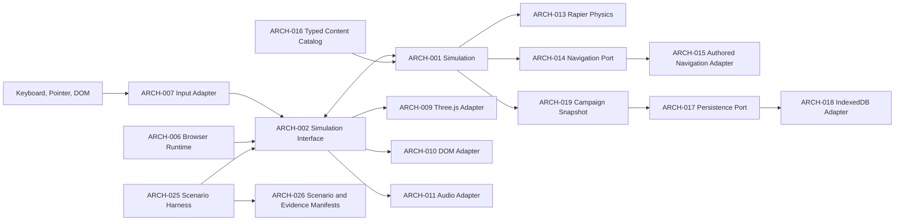

# Bold and Brave Playable Vertical Slice Architecture

## System overview

Bold and Brave is one Vite and TypeScript browser application. One deep, platform-neutral Simulation owns all gameplay truth. Its small interface accepts target-tick commands and fixed ticks. It returns immutable projections, typed feedback events, and validated snapshots.

The browser runtime and the Scenario Harness use the same Simulation Interface. Browser adapters translate supported input, render Three.js WebGPU Scenes, present semantic DOM panels, play Web Audio, and store snapshots in IndexedDB. Adapters own no gameplay result. Rapier runs inside the Simulation implementation. A Navigation Port isolates authored deterministic steering. Typed manifests provide immutable content and acceptance data.

## ARCH-001 — Simulation

| Attribute | Value |
| --- | --- |
| Type | Module |
| Status | Active |
| Requirements | REQ-001–REQ-002, REQ-004, REQ-007–REQ-009, REQ-017–REQ-032, REQ-034, REQ-036–REQ-053, REQ-055–REQ-059, REQ-061–REQ-066, REQ-068–REQ-076, REQ-078, REQ-080, REQ-082–REQ-086, REQ-088, REQ-095, REQ-110–REQ-111, REQ-114, REQ-116, REQ-121 |
| Dependencies | ARCH-002, ARCH-003, ARCH-004, ARCH-005, ARCH-013, ARCH-014, ARCH-016 |

**Responsibility:** Own all mutable gameplay state and apply all campaign and battle rules.

**Contract:** The module accepts work only through the Simulation Interface. It owns combat, Band orders, behavior, travel, settlement interaction, Local Contract transitions, survivor fates, Feat choice, resources, and save-safe transitions. It returns read-only projections and typed feedback events. It does not expose browser, Three.js, DOM, Web Audio, or IndexedDB types. Browser adapters cannot decide or mutate gameplay results. Internal organization stays private so that the external seam remains deep.

## ARCH-002 — Simulation Interface

| Attribute | Value |
| --- | --- |
| Type | Interface |
| Status | Active |
| Requirements | REQ-039, REQ-041–REQ-042, REQ-110–REQ-112, REQ-119, REQ-150 |
| Dependencies | ARCH-003, ARCH-019 |

**Responsibility:** Provide the only external gameplay seam for browser and scenario callers.

**Contract:** A caller submits typed commands with target ticks, advances exactly one fixed tick, reads the current immutable projection, drains ordered typed feedback events, requests a snapshot only at a save-safe state, or restores a validated plain snapshot. The interface contains no browser types. An illegal command keeps authoritative state unchanged and returns a typed invalid-action result. The same initial state, command order, tick sequence, and random state produce the same projections, events, and outcome.

## ARCH-003 — Authoritative Simulation State

| Attribute | Value |
| --- | --- |
| Type | Data |
| Status | Active |
| Requirements | REQ-001, REQ-008–REQ-009, REQ-017–REQ-018, REQ-021, REQ-024–REQ-032, REQ-034, REQ-036–REQ-038, REQ-043–REQ-047, REQ-051–REQ-054, REQ-056–REQ-059, REQ-061, REQ-067–REQ-080, REQ-082–REQ-086, REQ-088, REQ-095, REQ-123 |
| Dependencies | ARCH-016 |

**Responsibility:** Hold the only mutable truth for campaign and battle play.

**Owner:** ARCH-001 Simulation.

**Structure contract:** The state contains campaign time, current Scene and position, Local Contract and Raid data, Settlement condition, Band membership and resources, Agent relationships and fates, Feat state, battle and Command group state, Combatant health and stamina, deterministic random state, and save-safe state. It keeps social identity and Agent fate separate from common Combatant state. It contains no Three.js, DOM, Web Audio, IndexedDB, or serialized Rapier object.

**Flow:** Commands and fixed ticks update this state. Callers receive immutable projections. Save-safe state produces ARCH-019 snapshots.

## ARCH-004 — Combatant Role Policy

| Attribute | Value |
| --- | --- |
| Type | Mechanism |
| Status | Active |
| Requirements | REQ-002, REQ-008–REQ-009, REQ-043–REQ-046, REQ-049–REQ-059, REQ-061, REQ-063–REQ-066, REQ-068, REQ-072, REQ-123 |
| Dependencies | ARCH-001, ARCH-003, ARCH-005, ARCH-013 |

**Responsibility:** Apply role-specific battle rules without replacing social identity or Agent fate.

**Behavior:** Common Combatant state provides health, stamina, pose state, position, target, and active status. Explicit policies apply player-character, Companion, Troop, Agent, bandit, and settlement-resident behavior. The policy selects zero-health results, targeting, commands, resident flight, raider pressure, and post-battle effects. Agent relationship and fate data stay outside the common battle record.

**Quality constraints:** Policy evaluation is deterministic for a fixed tick and seed. A Combatant that leaves active combat cannot receive later targeting or damage.

## ARCH-005 — Deterministic Time and Randomness

| Attribute | Value |
| --- | --- |
| Type | Mechanism |
| Status | Active |
| Requirements | REQ-018–REQ-020, REQ-024, REQ-029, REQ-037, REQ-056, REQ-082, REQ-085, REQ-113, REQ-115, REQ-121, REQ-142 |
| Dependencies | ARCH-001, ARCH-003, ARCH-019 |

**Responsibility:** Make time, tick order, and gameplay randomness repeatable.

**Behavior:** The Simulation advances at 60 fixed ticks per Simulation second. Target-tick commands execute in a stable order. Campaign-time multipliers change movement, time, and Provisions by the same distance-based result. One injected seeded random source supplies every gameplay draw. The snapshot stores its state when later play can consume another draw. Gameplay does not use `Math.random` or ambient browser randomness.

**Quality constraints:** Exact reset state, seed, build, commands, and ticks produce equal state and event hashes. The Simulation never drops a fixed tick.

## ARCH-006 — Browser Runtime

| Attribute | Value |
| --- | --- |
| Type | Module |
| Status | Active |
| Requirements | REQ-001, REQ-113, REQ-134, REQ-138 |
| Dependencies | ARCH-002, ARCH-007, ARCH-008, ARCH-022, ARCH-023, ARCH-024 |

**Responsibility:** Coordinate browser lifecycle, frame execution, and adapters without owning gameplay truth.

**Contract:** The runtime performs capability gates, creates the Simulation and adapters, schedules target-tick commands, accumulates rendered-frame time, coordinates Scene transitions, and stops execution on terminal delivery failures. It owns browser-only lifecycle state and frame metrics. It does not own campaign or battle results. Retry restarts only the failed browser operation. Reload repeats all startup gates.

## ARCH-007 — Input Adapter

| Attribute | Value |
| --- | --- |
| Type | Module |
| Status | Active |
| Requirements | REQ-015, REQ-019, REQ-022, REQ-027, REQ-039–REQ-042, REQ-048, REQ-061, REQ-088, REQ-096, REQ-119 |
| Dependencies | ARCH-002, ARCH-006 |

**Responsibility:** Normalize supported browser input into the target-tick command stream.

**Contract:** The adapter converts keyboard events, Pointer Events, mouse buttons, pointer drags, pointer selections, and DOM actions into typed commands with target ticks. It preserves CSS-pixel coordinates and input phase so the Simulation decides dead zones, sectors, guards, commands, and command validity. It does not apply game rules. Unsupported input modes do not create a second command path.

## ARCH-008 — Browser Frame Collaboration

| Attribute | Value |
| --- | --- |
| Type | Collaboration |
| Status | Active |
| Requirements | REQ-029, REQ-113, REQ-138, REQ-146 |
| Dependencies | ARCH-002, ARCH-006, ARCH-009, ARCH-010, ARCH-011, ARCH-012, ARCH-023 |

**Responsibility:** Advance fixed gameplay ticks and present one coherent rendered frame.

**Participants:** Browser Runtime, Input Adapter, Simulation Interface, Three.js Presentation Adapter, DOM Interface Adapter, and Audio Adapter.

**Runtime behavior:** On each `requestAnimationFrame`, the runtime accumulates elapsed time and runs at most five pending fixed ticks. It does not discard remaining ticks. Each tick submits due commands, advances the Simulation once, and delivers typed feedback once. After the tick batch, adapters read one immutable projection. Three.js interpolates presentation only; DOM and audio use settled projection and event data. A device-loss signal stops further ticks before another frame result can occur.

## ARCH-009 — Three.js Presentation Adapter

| Attribute | Value |
| --- | --- |
| Type | Module |
| Status | Active |
| Requirements | REQ-001–REQ-002, REQ-006–REQ-007, REQ-011, REQ-027, REQ-033, REQ-038, REQ-040–REQ-042, REQ-044–REQ-045, REQ-057, REQ-061–REQ-062, REQ-089–REQ-096, REQ-110, REQ-118, REQ-121, REQ-136, REQ-146 |
| Dependencies | ARCH-002, ARCH-006, ARCH-016 |

**Responsibility:** Render Scenes and visual feedback from read-only gameplay output.

**Contract:** The adapter uses Three.js WebGPU for rendering. It owns the third-person camera, glTF loading, `AnimationMixer`, interpolation, lighting, visual effects, world markers, and canvas presentation. It consumes immutable projections and typed events. It stores no authoritative gameplay state and cannot decide combat, relationship, fate, or outcome results. A non-WebGPU Three.js backend cannot enter gameplay.

## ARCH-010 — DOM Interface Adapter

| Attribute | Value |
| --- | --- |
| Type | Module |
| Status | Active |
| Requirements | REQ-001–REQ-002, REQ-016, REQ-022–REQ-023, REQ-025, REQ-027, REQ-030–REQ-032, REQ-034, REQ-038, REQ-070, REQ-073, REQ-078, REQ-080, REQ-084, REQ-086, REQ-088, REQ-091, REQ-096–REQ-098, REQ-110, REQ-121, REQ-131–REQ-133 |
| Dependencies | ARCH-002, ARCH-006, ARCH-007 |

**Responsibility:** Present essential text and actions through semantic HTML and CSS.

**Contract:** The adapter renders the Journal, Local Contract, dialogue, save controls, error states, Feat choice, survivor-fate choices, and required HUD text from read-only projections. It sends every action through the Input Adapter. It owns focus and transient panel state only. It stores no campaign result. It shows typed invalid-action, storage, loading, audio, and support failures without changing Simulation state.

## ARCH-011 — Audio Adapter

| Attribute | Value |
| --- | --- |
| Type | Module |
| Status | Active |
| Requirements | REQ-001–REQ-002, REQ-044–REQ-045, REQ-061–REQ-062, REQ-093, REQ-099–REQ-110, REQ-120–REQ-121 |
| Dependencies | ARCH-002, ARCH-006 |

**Responsibility:** Turn typed feedback events into the specified Web Audio presentation.

**Contract:** The adapter initializes Web Audio after an explicit user gesture and reports not-ready, ready, or failed. It maps typed events to combat, command, Agent, movement, interface, ambience, and music cues. It applies the fixed priority, ducking, spatial, centered, and music-fade rules. It never derives or changes a gameplay result. Retry repeats audio initialization after failure.

## ARCH-012 — Presentation Collaboration

| Attribute | Value |
| --- | --- |
| Type | Collaboration |
| Status | Active |
| Requirements | REQ-002, REQ-039, REQ-093–REQ-096, REQ-099–REQ-110, REQ-118 |
| Dependencies | ARCH-002, ARCH-009, ARCH-010, ARCH-011 |

**Responsibility:** Keep visual, DOM, and audio feedback synchronized with authoritative state.

**Participants:** Simulation Interface, Three.js Presentation Adapter, DOM Interface Adapter, and Audio Adapter.

**Runtime behavior:** The Simulation publishes one immutable projection and ordered typed events for each completed tick. Each adapter consumes only the data it needs. Visual and DOM output settle from the same projection. Audio consumes each event once in order. Dropped, delayed, or failed presentation work cannot write back to the Simulation or change an outcome. Scenario evidence can inspect the same projection and event stream without a presentation adapter.

## ARCH-013 — Rapier Physics

| Attribute | Value |
| --- | --- |
| Type | Mechanism |
| Status | Active |
| Requirements | REQ-033, REQ-040, REQ-044–REQ-045, REQ-047, REQ-050–REQ-051, REQ-116 |
| Dependencies | ARCH-001, ARCH-003, ARCH-016, Rapier 3D |

**Responsibility:** Provide authoritative movement, collision, and spatial queries inside the Simulation.

**Behavior:** Rapier 3D runs with the Simulation on the main thread. It handles capsule movement, collision, impassable terrain, weapon-path queries, and local spatial queries. The Simulation applies game rules to query results and keeps deterministic once-per-tick ordering. Rapier objects remain runtime implementation data and never enter a campaign snapshot.

**Quality constraints:** Physics advances with the 60 Hz Simulation tick. Presentation interpolation cannot alter a physics result.

## ARCH-014 — Navigation Port

| Attribute | Value |
| --- | --- |
| Type | Interface |
| Status | Active |
| Requirements | REQ-018, REQ-027, REQ-033, REQ-035, REQ-062–REQ-064, REQ-066, REQ-117, REQ-120–REQ-121 |
| Dependencies | ARCH-003, ARCH-016 |

**Responsibility:** Isolate deterministic path and local-steering decisions from gameplay rules.

**Contract:** The interface receives current navigation state, a target or order, authored traversability data, and the current fixed tick. It returns a deterministic steering intent or a typed invalid result. It does not mutate Simulation state. It contains no Three.js or browser type. The Simulation remains responsible for Command group behavior, target choice, and order validity.

## ARCH-015 — Authored Navigation Adapter

| Attribute | Value |
| --- | --- |
| Type | Module |
| Status | Active |
| Requirements | REQ-018, REQ-033, REQ-035, REQ-062–REQ-064, REQ-066, REQ-117 |
| Dependencies | ARCH-014, ARCH-016 |

**Responsibility:** Navigate the slice with authored anchors and deterministic local steering.

**Contract:** The adapter satisfies the Navigation Port with authored anchors, traversability data, and deterministic local steering. It supports the free-roaming Overworld, formation movement, Hold points, Engage movement, the impassable river, and the single bridge crossing. It reports invalid or unreachable targets through the port. It owns no gameplay state and does not select combat outcomes.

## ARCH-016 — Typed Content Catalog

| Attribute | Value |
| --- | --- |
| Type | Data |
| Status | Active |
| Requirements | REQ-004, REQ-006–REQ-009, REQ-016–REQ-017, REQ-021–REQ-023, REQ-027, REQ-032–REQ-033, REQ-035, REQ-038, REQ-043, REQ-049, REQ-054–REQ-055, REQ-059, REQ-067, REQ-069, REQ-073, REQ-077–REQ-079, REQ-081, REQ-089, REQ-098, REQ-120–REQ-121 |
| Dependencies | None |

**Responsibility:** Define immutable authored gameplay and presentation content.

**Owner:** The build-time content layer.

**Structure contract:** Read-only typed manifests define Agents, Troops, weapons, Feats, settlement and battlefield data, Local Contract data, canonical text, visual and audio asset identifiers, navigation anchors, and authored tuning values. IDs are stable inside a build. The catalog contains no mutable campaign state and no runtime-generated content.

**Flow:** Build validation produces the catalog. The Simulation consumes gameplay values. Navigation consumes traversability and anchors. Browser adapters consume presentation and asset identifiers.

## ARCH-017 — Persistence Port

| Attribute | Value |
| --- | --- |
| Type | Interface |
| Status | Active |
| Requirements | REQ-010, REQ-025, REQ-120–REQ-121, REQ-125, REQ-130–REQ-133 |
| Dependencies | ARCH-019 |

**Responsibility:** Isolate versioned campaign storage from the Simulation.

**Contract:** The interface lists the three manual slots and separate autosave, reads one entry, writes one validated snapshot, deletes one manual slot, resets local campaign data after confirmation, and retries storage availability. Every operation returns a typed success or failure. The port accepts only current-version plain snapshots. It does not migrate data, create gameplay state, or report success after a failed write.

## ARCH-018 — IndexedDB Persistence Adapter

| Attribute | Value |
| --- | --- |
| Type | Module |
| Status | Active |
| Requirements | REQ-010, REQ-120, REQ-125, REQ-130–REQ-132 |
| Dependencies | ARCH-017, ARCH-019, browser IndexedDB |

**Responsibility:** Store validated campaign snapshots in browser-local IndexedDB.

**Contract:** The adapter satisfies the Persistence Port. It keeps three manual entries and one rolling autosave separate. It marks old, corrupt, and unreadable entries unavailable with a reason. It surfaces denial, unavailability, and quota failure. It never mutates the in-memory campaign and never owns gameplay truth. A later explicit retry can restore storage actions.

## ARCH-019 — Campaign Snapshot

| Attribute | Value |
| --- | --- |
| Type | Data |
| Status | Active |
| Requirements | REQ-010, REQ-083, REQ-115, REQ-126–REQ-127, REQ-129–REQ-130 |
| Dependencies | ARCH-003, ARCH-005, ARCH-016 |

**Responsibility:** Represent a complete validated save-safe campaign state as plain versioned data.

**Owner:** ARCH-001 Simulation creates and restores the data. ARCH-018 stores it without interpretation.

**Structure contract:** The schema contains the current Scene, exact position and campaign time, Band membership and state, equipment, Coin, Provisions and consumption remainder, Local Contract and Raid data, optional or final Settlement condition, Agent relationships and fates, ordinary-bandit result, Captive count, Feat, and gameplay random state. It excludes active battle, bridge setup, resolution, open interface state, camera state, Rapier objects, Three.js objects, and audio runtime state.

**Flow:** The Simulation creates a snapshot only in a save-safe state. Validation occurs before storage and before restore. Restore replaces state only after all validation and runtime rebuild work can succeed.

## ARCH-020 — Save-Safe State

| Attribute | Value |
| --- | --- |
| Type | Mechanism |
| Status | Active |
| Requirements | REQ-048, REQ-124, REQ-128, REQ-133 |
| Dependencies | ARCH-001, ARCH-003, ARCH-019 |

**Responsibility:** Enable save and load only when a complete non-combat snapshot is valid.

**Behavior:** The mechanism uses `Safe non-combat`, `Transitioning`, `Restoring snapshot`, `Battle and resolution`, and `Load failed`. Manual save and load work only in `Safe non-combat`. Scene transition, restore, bridge setup, battle, and post-battle resolution disable them before unsafe work starts. A successful Scene transition writes the rolling autosave before controls become available. A changed-settlement return becomes safe without a Scene-transition autosave. A failed restore keeps the prior campaign.

**Quality constraints:** No unsafe snapshot can enter storage. A state transition enables controls only after its required work succeeds.

## ARCH-021 — Save and Restore Collaboration

| Attribute | Value |
| --- | --- |
| Type | Collaboration |
| Status | Active |
| Requirements | REQ-124, REQ-128–REQ-133 |
| Dependencies | ARCH-001, ARCH-002, ARCH-017, ARCH-018, ARCH-019, ARCH-020 |

**Responsibility:** Persist and restore campaign state without partial replacement or hidden failure.

**Participants:** Simulation, Simulation Interface, Save-Safe State, Campaign Snapshot, Persistence Port, IndexedDB Persistence Adapter, DOM Interface Adapter, and browser runtime adapters.

**Runtime behavior:** Save requests first confirm a safe state, create and validate a snapshot, then write it. A write failure keeps play in memory, disables storage actions, and shows persistent failure. Restore reads and validates an entry before state replacement. It then rebuilds Rapier, Three.js, DOM, and audio runtime data. Any restore or rebuild failure keeps the prior campaign and valid actions. Manual restore does not write an autosave.

## ARCH-022 — Scene Transition and Loading Collaboration

| Attribute | Value |
| --- | --- |
| Type | Collaboration |
| Status | Active |
| Requirements | REQ-001, REQ-021, REQ-026, REQ-028, REQ-128, REQ-134, REQ-136–REQ-137 |
| Dependencies | ARCH-002, ARCH-006, ARCH-009, ARCH-016, ARCH-018, ARCH-020, ARCH-021 |

**Responsibility:** Move between the Overworld and Scene only after assets and state entry succeed.

**Participants:** Browser Runtime, Simulation Interface, Three.js Presentation Adapter, Typed Content Catalog, Save-Safe State, and IndexedDB Persistence Adapter.

**Runtime behavior:** The Simulation requests a transition and enters `Transitioning`. The runtime loads the target Scene by asset ID through download, decode, GPU upload, and readiness stages. It reports progress and detailed console records with Scene and asset IDs. The first failure stops the load and shows Retry; no automatic retry or elapsed-time limit applies. On full success, the Simulation enters the target state, the runtime writes the rolling autosave, and save controls become available.

## ARCH-023 — Browser Delivery State

| Attribute | Value |
| --- | --- |
| Type | Mechanism |
| Status | Active |
| Requirements | REQ-011, REQ-014, REQ-109, REQ-134–REQ-138 |
| Dependencies | ARCH-006, ARCH-008, ARCH-009, ARCH-011, ARCH-022, WebGPU, Web Audio |

**Responsibility:** Fail closed before gameplay and stop gameplay when browser capabilities fail.

**Behavior:** Startup checks secure context, `navigator.gpu`, a physical adapter, a core-capability device, and the Three.js WebGPU backend in order. A failed gate enters a readable `Unsupported` state before asset loading. Passed gates enter `Loading Scene`; the first load failure enters `Load failed` with Retry. Campaign start also requires `Audio ready`. A resolved `GPUDevice.lost` promise enters `Device lost`, stops Simulation ticks immediately, and offers Reload. Reload repeats all gates.

**Quality constraints:** No WebGL fallback, software adapter, silent audio failure, or hidden gameplay advance is permitted.

## ARCH-024 — Browser Deployment

| Attribute | Value |
| --- | --- |
| Type | Deployment |
| Status | Active |
| Requirements | REQ-001, REQ-010–REQ-015, REQ-111, REQ-116, REQ-135, REQ-139–REQ-140 |
| Dependencies | ARCH-006, ARCH-009, ARCH-010, ARCH-011, ARCH-013, ARCH-018, ARCH-023 |

**Responsibility:** Place the complete Playable Vertical Slice in one local-state browser application.

**Placement:** One Vite and TypeScript application runs in Chromium. Simulation and Rapier run on the main thread. Browser modules use WebGPU, semantic DOM, Web Audio, and IndexedDB. The deployment has no account, backend, server-owned state, cloud save, or online synchronization.

**Runtime constraints:** The promised row is Chromium 151.0.7922.137 on Linux x64 with an NVIDIA RTX 2070 SUPER and driver 610.57.04. Acceptance uses a 1920 × 1080 CSS-pixel viewport and device-pixel ratio no greater than 1.0. Gameplay requires a secure context, a physical WebGPU adapter, core WebGPU, normal keyboard-and-mouse input, and ready Web Audio.

## ARCH-025 — Scenario Harness

| Attribute | Value |
| --- | --- |
| Type | Module |
| Status | Active |
| Requirements | REQ-003, REQ-060, REQ-081, REQ-113, REQ-121–REQ-122, REQ-139–REQ-143, REQ-145–REQ-147, REQ-150 |
| Dependencies | ARCH-002, ARCH-016, ARCH-024, ARCH-026 |

**Responsibility:** Run deterministic acceptance scenarios through the same gameplay seam as the browser.

**Contract:** The harness loads one typed scenario manifest, resets its validated initial state, submits its exact target-tick public commands, advances exact ticks, and stops at fixed checkpoints. It collects projections, events, random state, assertions, metrics, and required artifacts. Test-only setup can select a valid preset before start but cannot force an outcome after start. Browser-independent runs use Vitest. Browser checkpoints use Playwright contexts.

## ARCH-026 — Scenario and Evidence Manifests

| Attribute | Value |
| --- | --- |
| Type | Data |
| Status | Active |
| Requirements | REQ-120, REQ-141–REQ-145, REQ-147–REQ-151 |
| Dependencies | ARCH-016 |

**Responsibility:** Define deterministic scenario inputs and link all generated acceptance evidence.

**Owner:** ARCH-025 Scenario Harness owns generated evidence. The build owns read-only scenario definitions.

**Structure contract:** Scenario definitions contain stable names, unsigned 32-bit seeds, reset data, target-tick transcripts, required paths, checkpoints, expected assertions, and visual-artifact rules. Generated records contain build and specification identifiers, environment, render backend, transcript hash, tick, expected and actual assertions, outcome, state path, artifact type and path, and applicable frame metrics.

**Flow:** The harness reads scenario definitions, emits checkpoint records, and writes one linked evidence manifest. Acceptance rejects missing, stale, manual, or unlinked evidence.

## ARCH-027 — Acceptance Evidence Collaboration

| Attribute | Value |
| --- | --- |
| Type | Collaboration |
| Status | Active |
| Requirements | REQ-003, REQ-060, REQ-081, REQ-122, REQ-139–REQ-140, REQ-142–REQ-147, REQ-149–REQ-151 |
| Dependencies | ARCH-002, ARCH-008, ARCH-009, ARCH-025, ARCH-026, Vitest, Playwright |

**Responsibility:** Produce reproducible machine and visual evidence at architecture seams.

**Participants:** Scenario Harness, Simulation Interface, Browser Frame Collaboration, Three.js Presentation Adapter, Vitest, Playwright, and Scenario and Evidence Manifests.

**Runtime behavior:** The harness resets a scenario, executes exact commands, and records a validated snapshot plus conventional assertions at each checkpoint. Playwright captures a PNG only for a stable static claim after two rendered frames. It captures a WebM clip only for a transition, timing, or audio claim and limits it to 8 seconds with context, input, outcome, and settled result. Failure preserves the snapshot, transcript, failed assertion, console records, and relevant artifact. Deterministic replay compares state, event, random, artifact-metadata, and outcome hashes.

## ARCH-028 — Performance and Resource Limits

| Attribute | Value |
| --- | --- |
| Type | Mechanism |
| Status | Active |
| Requirements | REQ-003, REQ-013, REQ-060, REQ-139–REQ-140 |
| Dependencies | ARCH-006, ARCH-008, ARCH-024, ARCH-025, ARCH-027 |

**Responsibility:** Measure and enforce the specified frame, tick, and duration limits on the promised row.

**Behavior:** The browser runtime reports average and 95th-percentile frame time and detects continuous below-30-frames-per-second intervals. The Scenario Harness measures full-play and battle durations with the fixed acceptance seeds. The frame loop processes at most five catch-up ticks per rendered frame and preserves remaining ticks.

**Quality constraints:** The seeded bridge target is an average frame time no greater than 16.67 milliseconds and a 95th percentile no greater than 33.33 milliseconds. No below-30-frames-per-second interval can exceed 1.00 second. The full journey target is 45–60 minutes. Battle targets are 3–5 minutes at the bridge and 4–6 minutes at the settlement center.

## Requirement coverage

| Requirement | Title | Architecture coverage |
| --- | --- | --- |
| REQ-001 | Complete playable journey | ARCH-001, ARCH-003, ARCH-006, ARCH-009, ARCH-010, ARCH-011, ARCH-022, ARCH-024 |
| REQ-002 | Representative-quality priorities | ARCH-001, ARCH-004, ARCH-009, ARCH-010, ARCH-011, ARCH-012 |
| REQ-003 | First-playthrough duration | ARCH-025, ARCH-027, ARCH-028 |
| REQ-004 | Deliberate scope simplicity | ARCH-001, ARCH-016 |
| REQ-006 | Frontier setting and player magic | ARCH-009, ARCH-016 |
| REQ-007 | Playable population and spaces | ARCH-001, ARCH-009, ARCH-016 |
| REQ-008 | Battle Band composition | ARCH-001, ARCH-003, ARCH-004, ARCH-016 |
| REQ-009 | Required roles and resolutions | ARCH-001, ARCH-003, ARCH-004, ARCH-016 |
| REQ-010 | Local operation and campaign saves | ARCH-017, ARCH-018, ARCH-019, ARCH-024 |
| REQ-011 | WebGPU-only rendering | ARCH-009, ARCH-023, ARCH-024 |
| REQ-012 | Promised machine | ARCH-024 |
| REQ-013 | Promised-row test display | ARCH-024, ARCH-028 |
| REQ-014 | WebGPU startup gates | ARCH-023, ARCH-024 |
| REQ-015 | Input and support exclusions | ARCH-007, ARCH-024 |
| REQ-016 | Canonical player-facing terms | ARCH-010, ARCH-016 |
| REQ-017 | New campaign start position | ARCH-001, ARCH-003, ARCH-016 |
| REQ-018 | Overworld movement and time | ARCH-001, ARCH-003, ARCH-005, ARCH-014, ARCH-015 |
| REQ-019 | Overworld pause and time speed | ARCH-001, ARCH-005, ARCH-007 |
| REQ-020 | Overworld time scaling | ARCH-001, ARCH-005 |
| REQ-021 | Settlement Scene entry and layout | ARCH-001, ARCH-003, ARCH-016, ARCH-022 |
| REQ-022 | Settlement contextual actions and dialogue | ARCH-001, ARCH-007, ARCH-010, ARCH-016 |
| REQ-023 | Local Contract offer | ARCH-001, ARCH-010, ARCH-016 |
| REQ-024 | Settlement time advancement | ARCH-001, ARCH-003, ARCH-005 |
| REQ-025 | Journal contents and preparation access | ARCH-001, ARCH-003, ARCH-010, ARCH-017 |
| REQ-026 | Settlement exit | ARCH-001, ARCH-003, ARCH-022 |
| REQ-027 | Bridge setup | ARCH-001, ARCH-003, ARCH-007, ARCH-009, ARCH-010, ARCH-014, ARCH-016 |
| REQ-028 | Late settlement entry battle | ARCH-001, ARCH-003, ARCH-022 |
| REQ-029 | Combat outcome freeze | ARCH-001, ARCH-003, ARCH-005, ARCH-008 |
| REQ-030 | Victory resolution sequence | ARCH-001, ARCH-003, ARCH-010 |
| REQ-031 | Defeat resolution sequence | ARCH-001, ARCH-003, ARCH-010 |
| REQ-032 | Post-result restrictions and reactions | ARCH-001, ARCH-003, ARCH-010, ARCH-016 |
| REQ-033 | Bridge battlefield layout | ARCH-009, ARCH-013, ARCH-014, ARCH-015, ARCH-016 |
| REQ-034 | Outcome summary contents | ARCH-001, ARCH-003, ARCH-010 |
| REQ-035 | Extensible free-roaming Overworld | ARCH-014, ARCH-015, ARCH-016 |
| REQ-036 | Local Contract state transitions | ARCH-001, ARCH-003 |
| REQ-037 | Battle outcome state transitions | ARCH-001, ARCH-003, ARCH-005 |
| REQ-038 | Settlement condition transition | ARCH-001, ARCH-003, ARCH-009, ARCH-010, ARCH-016 |
| REQ-039 | Invalid gameplay command response | ARCH-001, ARCH-002, ARCH-007, ARCH-012 |
| REQ-040 | Combat camera and movement | ARCH-001, ARCH-007, ARCH-009, ARCH-013 |
| REQ-041 | Directional attack input | ARCH-001, ARCH-002, ARCH-007, ARCH-009 |
| REQ-042 | Directional Guard input | ARCH-001, ARCH-002, ARCH-007, ARCH-009 |
| REQ-043 | Fixed combat loadouts and guard modes | ARCH-001, ARCH-003, ARCH-004, ARCH-016 |
| REQ-044 | Shield Block behavior | ARCH-001, ARCH-003, ARCH-004, ARCH-009, ARCH-011, ARCH-013 |
| REQ-045 | Directional Guard outcomes | ARCH-001, ARCH-003, ARCH-004, ARCH-009, ARCH-011, ARCH-013 |
| REQ-046 | Attack commitment and guard cancellation | ARCH-001, ARCH-003, ARCH-004 |
| REQ-047 | Combat-action movement speeds | ARCH-001, ARCH-003, ARCH-013 |
| REQ-048 | Battle pause and unavailable actions | ARCH-001, ARCH-007, ARCH-020 |
| REQ-049 | Weapon sector values | ARCH-001, ARCH-004, ARCH-016 |
| REQ-050 | Weapon-path damage | ARCH-001, ARCH-004, ARCH-013 |
| REQ-051 | Health and damage exclusions | ARCH-001, ARCH-003, ARCH-004, ARCH-013 |
| REQ-052 | Stamina values | ARCH-001, ARCH-003, ARCH-004 |
| REQ-053 | Zero-stamina exhaustion | ARCH-001, ARCH-003, ARCH-004 |
| REQ-054 | Combatant base values | ARCH-003, ARCH-004, ARCH-016 |
| REQ-055 | Engage pressure and enemy strikes | ARCH-001, ARCH-004, ARCH-016 |
| REQ-056 | Seeded casualty draw | ARCH-001, ARCH-003, ARCH-004, ARCH-005 |
| REQ-057 | Inactive casualty state | ARCH-001, ARCH-003, ARCH-004, ARCH-009 |
| REQ-058 | Post-victory casualty results | ARCH-001, ARCH-003, ARCH-004 |
| REQ-059 | Settlement resident setup and behavior | ARCH-001, ARCH-003, ARCH-004, ARCH-016 |
| REQ-060 | Battle completion time | ARCH-025, ARCH-027, ARCH-028 |
| REQ-061 | Command group selection and orders | ARCH-001, ARCH-003, ARCH-004, ARCH-007, ARCH-009, ARCH-011 |
| REQ-062 | Invalid Hold point | ARCH-001, ARCH-009, ARCH-011, ARCH-014, ARCH-015 |
| REQ-063 | Group behavior after target loss | ARCH-001, ARCH-004, ARCH-014, ARCH-015 |
| REQ-064 | Raider target selection | ARCH-001, ARCH-004, ARCH-014, ARCH-015 |
| REQ-065 | Raider attack concurrency | ARCH-001, ARCH-004 |
| REQ-066 | Raider and resident objectives | ARCH-001, ARCH-004, ARCH-014, ARCH-015 |
| REQ-067 | Initial named-Agent state | ARCH-003, ARCH-016 |
| REQ-068 | Agent fate transitions | ARCH-001, ARCH-003, ARCH-004 |
| REQ-069 | Relationship outcomes | ARCH-001, ARCH-003, ARCH-016 |
| REQ-070 | Ordinary-bandit survivor choice | ARCH-001, ARCH-003, ARCH-010 |
| REQ-071 | Ordinary-bandit survivor outcomes | ARCH-001, ARCH-003 |
| REQ-072 | Named-Agent isolation from ordinary-bandit choice | ARCH-001, ARCH-003, ARCH-004 |
| REQ-073 | Victory Feat selection and effects | ARCH-001, ARCH-003, ARCH-010, ARCH-016 |
| REQ-074 | Victory Feat eligibility | ARCH-001, ARCH-003 |
| REQ-075 | Feat and Troop progression limits | ARCH-001, ARCH-003 |
| REQ-076 | Feat action scope | ARCH-001, ARCH-003 |
| REQ-077 | Initial preparation resources | ARCH-003, ARCH-016 |
| REQ-078 | Troop recruitment cost | ARCH-001, ARCH-003, ARCH-010, ARCH-016 |
| REQ-079 | Fixed equipment | ARCH-003, ARCH-016 |
| REQ-080 | Journal recruitment availability | ARCH-001, ARCH-003, ARCH-010 |
| REQ-081 | Default battle preparation | ARCH-016, ARCH-025, ARCH-027 |
| REQ-082 | Moving travel consumption rate | ARCH-001, ARCH-003, ARCH-005 |
| REQ-083 | Consumption remainder | ARCH-001, ARCH-003, ARCH-019 |
| REQ-084 | Provisions floor and display | ARCH-001, ARCH-003, ARCH-010 |
| REQ-085 | Non-moving consumption exclusions | ARCH-001, ARCH-003, ARCH-005 |
| REQ-086 | Local Contract reward | ARCH-001, ARCH-003, ARCH-010 |
| REQ-088 | Recruitment interaction and failure | ARCH-001, ARCH-003, ARCH-007, ARCH-010 |
| REQ-089 | Representative visual language | ARCH-009, ARCH-016 |
| REQ-090 | Scene camera and health display | ARCH-009 |
| REQ-091 | Accepted Local Contract HUD | ARCH-009, ARCH-010 |
| REQ-092 | Sector control and stamina display | ARCH-009 |
| REQ-093 | Combat result readability | ARCH-009, ARCH-011, ARCH-012 |
| REQ-094 | Hold position markers | ARCH-009, ARCH-012 |
| REQ-095 | Combatant fate concealment | ARCH-001, ARCH-003, ARCH-009, ARCH-012 |
| REQ-096 | Enemy Agent fate choice | ARCH-007, ARCH-009, ARCH-010, ARCH-012 |
| REQ-097 | Semantic DOM panels | ARCH-010 |
| REQ-098 | Text-only dialogue | ARCH-010, ARCH-016 |
| REQ-099 | Audio mix priority | ARCH-011, ARCH-012 |
| REQ-100 | Sector pitch and weapon materials | ARCH-011, ARCH-012 |
| REQ-101 | Combat action cues | ARCH-011, ARCH-012 |
| REQ-102 | Order response cues | ARCH-011, ARCH-012 |
| REQ-103 | Movement and interaction cues | ARCH-011, ARCH-012 |
| REQ-104 | Settlement-state cue triggers | ARCH-011, ARCH-012 |
| REQ-105 | Agent Downed reaction | ARCH-011, ARCH-012 |
| REQ-106 | Sparse interface cues | ARCH-011, ARCH-012 |
| REQ-107 | Ambient music behavior | ARCH-011, ARCH-012 |
| REQ-108 | Spatial and centered audio | ARCH-011, ARCH-012 |
| REQ-109 | Audio readiness gate | ARCH-011, ARCH-012, ARCH-023 |
| REQ-110 | Presentation authority | ARCH-001, ARCH-002, ARCH-009, ARCH-010, ARCH-011, ARCH-012 |
| REQ-111 | Authoritative Simulation seam | ARCH-001, ARCH-002, ARCH-024 |
| REQ-112 | Simulation inputs and outputs | ARCH-002 |
| REQ-113 | Fixed-tick execution | ARCH-005, ARCH-006, ARCH-008, ARCH-025 |
| REQ-114 | Simulation-owned gameplay | ARCH-001 |
| REQ-115 | Seeded randomness | ARCH-005, ARCH-019 |
| REQ-116 | Main-thread physics | ARCH-001, ARCH-013, ARCH-024 |
| REQ-117 | Replaceable navigation | ARCH-014, ARCH-015 |
| REQ-118 | Three.js presentation role | ARCH-009, ARCH-012 |
| REQ-119 | Unified command input | ARCH-002, ARCH-007 |
| REQ-120 | Ports and typed manifests | ARCH-011, ARCH-014, ARCH-016, ARCH-017, ARCH-018, ARCH-026 |
| REQ-121 | Platform-neutral dependency direction | ARCH-001, ARCH-005, ARCH-009, ARCH-010, ARCH-011, ARCH-014, ARCH-016, ARCH-017, ARCH-025 |
| REQ-122 | Verification tool use | ARCH-025, ARCH-027 |
| REQ-123 | Combatant state and policies | ARCH-003, ARCH-004 |
| REQ-124 | Save-safe state transitions | ARCH-020, ARCH-021 |
| REQ-125 | Save-slot allocation | ARCH-017, ARCH-018 |
| REQ-126 | Persisted campaign state | ARCH-019 |
| REQ-127 | Excluded snapshot state | ARCH-019 |
| REQ-128 | Transition autosave | ARCH-020, ARCH-021, ARCH-022 |
| REQ-129 | Validated snapshot restoration | ARCH-019, ARCH-021 |
| REQ-130 | Unavailable save entries | ARCH-017, ARCH-018, ARCH-019, ARCH-021 |
| REQ-131 | Storage failure handling | ARCH-010, ARCH-017, ARCH-018, ARCH-021 |
| REQ-132 | Confirmed local-data deletion | ARCH-010, ARCH-017, ARCH-018, ARCH-021 |
| REQ-133 | Manual save and load access | ARCH-010, ARCH-017, ARCH-020, ARCH-021 |
| REQ-134 | Ordered browser delivery states | ARCH-006, ARCH-022, ARCH-023 |
| REQ-135 | Core WebGPU request | ARCH-023, ARCH-024 |
| REQ-136 | Scene asset loading progress | ARCH-009, ARCH-022, ARCH-023 |
| REQ-137 | Scene-load diagnostics | ARCH-022, ARCH-023 |
| REQ-138 | Rendering-device loss stop | ARCH-006, ARCH-008, ARCH-023 |
| REQ-139 | Seeded bridge-battle frame-time target | ARCH-024, ARCH-025, ARCH-027, ARCH-028 |
| REQ-140 | Sustained frame-rate floor | ARCH-024, ARCH-025, ARCH-027, ARCH-028 |
| REQ-141 | Acceptance scenario definition | ARCH-025, ARCH-026 |
| REQ-142 | Deterministic scenario replay | ARCH-005, ARCH-025, ARCH-026, ARCH-027 |
| REQ-143 | Checkpoint snapshots and assertions | ARCH-025, ARCH-026, ARCH-027 |
| REQ-144 | Generated evidence manifest | ARCH-026, ARCH-027 |
| REQ-145 | Visual evidence format | ARCH-025, ARCH-026, ARCH-027 |
| REQ-146 | Stable screenshot capture | ARCH-008, ARCH-009, ARCH-025, ARCH-027 |
| REQ-147 | Failure evidence preservation | ARCH-025, ARCH-026, ARCH-027 |
| REQ-148 | Acceptance scenario catalog | ARCH-026 |
| REQ-149 | Acceptance checkpoint catalog | ARCH-026, ARCH-027 |
| REQ-150 | Acceptance scenario execution | ARCH-002, ARCH-025, ARCH-026, ARCH-027 |
| REQ-151 | Generated evidence provenance | ARCH-026, ARCH-027 |
| REQ-165 | Specification completeness gate | No architecture impact — Document-governance requirement; it has no runtime architecture impact. |
| REQ-166 | Specification audit lifecycle | No architecture impact — Document-governance requirement; it has no runtime architecture impact. |
